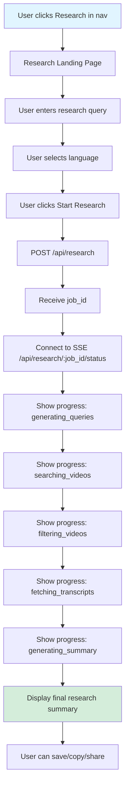

# AI-Powered Video Research Feature - Frontend PRD

## Executive Summary

This PRD outlines the frontend implementation of the AI-powered video research feature. The frontend will provide a seamless user experience for creating research summaries by inputting a research query, monitoring progress through real-time SSE updates, and viewing comprehensive multi-perspective summaries. The implementation will maximize code reuse from the existing YouTube summary feature while maintaining a distinct, purpose-built interface.

> **⚠️ IMPORTANT**: Before implementation, review `CONSISTENCY_AND_RACE_CONDITION_ANALYSIS.md` for critical fixes needed to prevent race conditions and ensure type consistency with the backend API.

---

## Feature Overview

### Current State
- Users manually provide YouTube video URLs on the dashboard (`/`)
- System processes videos and generates summaries
- History page shows past summaries
- Navigation includes: Home, History, Theme Toggle, Language, User Menu

### Proposed State
- New "Research" link in top navigation
- Dedicated research landing page (`/research`)
- Research query input (text field instead of URL input)
- Real-time progress tracking via SSE (similar to summary feature)
- Research results display with 5-question framework
- Research history integration (optional, can reuse history page with filters)

### Key Benefits
1. **Consistent UX**: Reuses existing patterns, components, and design system
2. **Code Efficiency**: Leverages 80%+ of existing infrastructure
3. **Familiar Interface**: Users already understand the flow from summary feature
4. **Maintainability**: Shared components reduce duplication

---

## User Flow



### Detailed Steps

1. **Navigation**: User clicks "Research" link in top navigation
2. **Landing Page**: Research page loads with query input form
3. **Input**: User types research query (e.g., "impact of AI on healthcare")
4. **Language Selection**: User selects output language (reuses existing language dropdown)
5. **Submit**: User clicks "Start Research" button
6. **Processing**: Real-time progress updates via SSE (similar to summary feature)
7. **Results**: Final research summary displayed with 5-question structure
8. **Actions**: User can copy, save, or share the research

---

## Technical Architecture

### Code Reuse Strategy

#### High Reuse (90-100%)
- **Config Files**: `routes.ts`, `api.ts`, `visual-effects.ts`, `messages.ts`, `languages.ts`
- **Contexts**: `AuthContext`, `ToastContext`
- **UI Components**: `Button`, `Card`, `LanguageDropdown`, `ThemeToggle`, `UserMenu`
- **Utilities**: `date.ts`, `analytics.ts`, `utils.ts`
- **Hooks Pattern**: Similar to `useSummaryStream` → `useResearchStream`
- **SSE Infrastructure**: `AuthenticatedSSE` class, connection management
- **Layout**: `AppLayoutWrapper`, header structure

#### Medium Reuse (50-80%)
- **Processing Components**: Adapt `ProcessingSidebar` for research statuses
- **Result Display**: Adapt `ResultCard` for research format
- **Error Handling**: Reuse `ErrorState`, `StreamingError` patterns
- **Progress Tracking**: Adapt progress bar and status messages

#### New Components (0-20%)
- **ResearchQueryInput**: Text area for research query (similar to `UrlInputArea`)
- **ResearchProgressSidebar**: Research-specific progress display
- **ResearchResultCard**: Research summary display with 5-question structure
- **SelectedVideosList**: Display selected videos with classifications
- **ResearchHistoryCard**: Optional card for research history (if separate from summaries)

---

## New Routes

### Route Configuration

**File**: `frontend/src/config/routes.ts` (additions)

```typescript
export const routes = {
  // ... existing routes
  research: '/research',
  researchHistory: '/research/history', // Optional: separate research history
} as const;
```

### Page Structure

```
frontend/src/app/
  research/
    page.tsx          # Main research landing page
    [jobId]/
      page.tsx        # Optional: Direct link to research result
```

---

## New Components

### 1. ResearchQueryInput

**File**: `frontend/src/components/research/ResearchQueryInput.tsx`

**Purpose**: Text input area for research query (similar to `UrlInputArea`)

**Props**:
```typescript
interface ResearchQueryInputProps {
  value: string;
  onChange: (value: string) => void;
  placeholder?: string;
  disabled?: boolean;
}
```

**Design**:
- Large textarea (similar to URL input area)
- Character counter (10-500 characters)
- Placeholder: "What would you like to research? (e.g., 'impact of AI on healthcare')"
- Validation feedback inline

**Reuses**:
- Styling from `UrlInputArea`
- Visual effects config (`spacing`, `colors`, `typography`)
- Validation patterns

---

### 2. ResearchProgressSidebar

**File**: `frontend/src/components/research/ResearchProgressSidebar.tsx`

**Purpose**: Display research progress with phase-specific messages

**Props**:
```typescript
interface ResearchProgressSidebarProps {
  status: ResearchStatus;
  progress: number;
  message: string | null;
  generatedQueries?: string[];
  selectedVideos?: SelectedVideo[];
  videoCount?: number;
  onCancel?: () => void;
}
```

**Status Messages**:
- `generating_queries`: "Generating search queries..."
- `searching_videos`: "Searching for videos..." (show generated queries)
- `filtering_videos`: "Filtering best videos..."
- `fetching_transcripts`: "Fetching transcripts..." (show selected videos)
- `generating_summary`: "Generating comprehensive summary..."

**Reuses**:
- `ProcessingSidebar` component structure
- `WhimsicalLoader` for animations
- `ProgressBar` component
- `StatusMessage` component
- Layout config from `visual-effects.ts`

---

### 3. ResearchResultCard

**File**: `frontend/src/components/research/ResearchResultCard.tsx`

**Purpose**: Display final research summary with 5-question structure

**Props**:
```typescript
interface ResearchResultCardProps {
  research: ResearchResponse | null;
  streamedText: string;
  isStreaming: boolean;
  progress?: number;
  title?: string | null;
  selectedVideos?: SelectedVideo[];
  className?: string;
}
```

**Features**:
- Markdown rendering (reuse `MarkdownStreamer`)
- Copy button (reuse existing pattern)
- Save button (reuse existing pattern)
- Selected videos list (new component, see below)
- 5-question structure highlighting (optional visual enhancement)

**Reuses**:
- `ResultCard` component structure
- `MarkdownStreamer` component
- `Button` components
- Card styling from `visual-effects.ts`

---

### 4. SelectedVideosList

**File**: `frontend/src/components/research/SelectedVideosList.tsx`

**Purpose**: Display selected videos with classifications and rationale

**Props**:
```typescript
interface SelectedVideosListProps {
  videos: SelectedVideo[];
  className?: string;
}

interface SelectedVideo {
  video_id: string;
  title: string;
  channel: string;
  thumbnail: string;
  duration_seconds: number;
  url: string;
  classification: 'Direct' | 'Foundational' | 'Contrarian';
  why_selected: string;
  fills_gap: string;
}
```

**Design**:
- Grid layout (similar to `SourceVideosList`)
- Classification badges (color-coded)
- Expandable cards showing "why_selected" and "fills_gap"
- Thumbnail previews
- Click to open YouTube video

**Reuses**:
- Grid layout patterns from `SourceVideosList`
- Card components
- Badge components (if exists, or create simple badge)

---

### 5. ResearchForm

**File**: `frontend/src/components/research/ResearchForm.tsx`

**Purpose**: Form container for research query input and language selection

**Props**:
```typescript
interface ResearchFormProps {
  query: string;
  onQueryChange: (query: string) => void;
  language: string;
  onLanguageChange: (language: string) => void;
  onSubmit: () => void;
  disabled?: boolean;
  canSubmit?: boolean;
}
```

**Reuses**:
- `ControlPanel` language selection (or extracts language selector)
- Form validation patterns
- Button components
- Layout from dashboard form

---

## Race Condition Prevention & Data Consistency

### Overview

To avoid data syncing problems experienced in the summary feature, the research feature implements comprehensive race condition prevention at the frontend layer.

### Request Deduplication

#### Implementation in useResearchStream

**Request Fingerprinting**:
```typescript
const getRequestFingerprint = (request: ResearchRequest): string => {
  return JSON.stringify({
    research_query: request.research_query.trim().toLowerCase(),
    language: request.language,
  });
};
```

**In-Flight Tracking**:
```typescript
const inFlightRequestsRef = useRef<Set<string>>(new Set());

const startJob = useCallback(async (payload: ResearchRequest) => {
  const fingerprint = getRequestFingerprint(payload);
  
  // Check if already in-flight
  if (inFlightRequestsRef.current.has(fingerprint)) {
    toast.warning('This research is already being processed');
    return;
  }
  
  // Add to in-flight set
  inFlightRequestsRef.current.add(fingerprint);
  
  try {
    const result = await startResearchJob(payload);
    if (result.data?.job_id) {
      await connect(result.data.job_id);
    }
  } finally {
    // Remove from in-flight set after delay
    setTimeout(() => {
      inFlightRequestsRef.current.delete(fingerprint);
    }, 5000);
  }
}, []);
```

### Button Disable During Submission

**Implementation in ResearchForm**:
```typescript
const [isSubmitting, setIsSubmitting] = useState(false);

const handleSubmit = async () => {
  if (isSubmitting) return; // Prevent double submission
  
  setIsSubmitting(true);
  
  try {
    await onSubmit();
  } finally {
    setTimeout(() => {
      setIsSubmitting(false);
    }, 1000);
  }
};

// In JSX:
<Button 
  disabled={!canSubmit || isSubmitting}
  onClick={handleSubmit}
>
  {isSubmitting ? 'Starting...' : 'Start Research'}
</Button>
```

### SSE Connection Management

#### Duplicate Connection Prevention

**Connection State Check**:
```typescript
const eventSourceRef = useRef<EventSource | null>(null);

const connect = useCallback((jobId: string) => {
  // Check if already connected
  if (eventSourceRef.current && 
      eventSourceRef.current.readyState !== EventSource.CLOSED) {
    logger.warn(`Already connected to job ${jobId}, skipping`);
    return Promise.resolve();
  }
  
  // Create new connection...
}, []);
```

#### Cleanup on Unmount

```typescript
useEffect(() => {
  return () => {
    // Cleanup connection on unmount
    if (eventSourceRef.current) {
      eventSourceRef.current.close();
      eventSourceRef.current = null;
    }
  };
}, []);
```

### Data Consistency

#### Type Safety

- **Complete Type Definitions**: All fields from backend API included in TypeScript types
- **Field Name Consistency**: Use snake_case to match backend (`raw_video_results`, not `rawVideoResults`)
- **Optional Fields**: Properly mark optional fields that may not be available during processing

#### State Management

- **Single Source of Truth**: `useResearchStream` hook manages all research state
- **Atomic Updates**: Update state only when SSE events received
- **Error Recovery**: Handle connection drops and reconnection gracefully

### Testing Requirements

#### Race Condition Tests
- [ ] Double-click submit → only 1 job created
- [ ] Rapid form submission → only 1 job created
- [ ] Network retry → doesn't create duplicate job
- [ ] React Strict Mode → no duplicate connections
- [ ] Page refresh → reconnects correctly

#### Data Consistency Tests
- [ ] SSE update → state updates correctly
- [ ] Connection drop → reconnection gets latest state
- [ ] Type safety → no runtime type errors
- [ ] Missing fields → handled gracefully

---

## New Hooks

### useResearchStream

**File**: `frontend/src/hooks/useResearchStream.ts`

**Purpose**: Manage SSE connection for research job status (similar to `useSummaryStream`)

**Interface**:
```typescript
export interface UseResearchStreamReturn {
  startJob: (payload: ResearchRequest) => Promise<void>;
  status: ResearchStatus | 'idle' | 'connected';
  progress: number;
  message: string | null;
  streamedText: string;
  title: string | null;
  error: string | null;
  errorType?: StreamingErrorType;
  errorCode?: string;
  isStreaming: boolean;
  generatedQueries?: string[];
  selectedVideos?: SelectedVideo[];
  research: ResearchResponse | null;
  reset: () => void;
  isConnected: boolean;
  isReconnecting: boolean;
  reconnectAttempts: number;
  manualReconnect: () => void;
  isCompleted: boolean;
  isCompleting: boolean;
}
```

**Reuses**:
- 90% of `useSummaryStream` logic
- `AuthenticatedSSE` class
- Reconnection logic
- Chunk accumulation
- Error handling patterns

**Differences**:
- Different status types (`generating_queries`, `searching_videos`, etc.)
- Additional data fields (`generated_queries`, `selected_videos`)
- Different API endpoints

---

### useResearchForm

**File**: `frontend/src/hooks/useResearchForm.ts`

**Purpose**: Manage research form state and validation

**Interface**:
```typescript
export interface UseResearchFormReturn {
  query: string;
  setQuery: (query: string) => void;
  language: string;
  setLanguage: (language: string) => void;
  hasValidQuery: boolean;
  getFormData: () => ResearchRequest | null;
  reset: () => void;
}
```

**Reuses**:
- Validation patterns from `useSummaryForm`
- Language selection logic
- Form state management patterns

---

## New Types

### Type Definitions

**File**: `frontend/src/types/research.ts` (new file)

```typescript
export type ResearchStatus =
  | 'idle'
  | 'connected'
  | 'generating_queries'
  | 'searching_videos'
  | 'filtering_videos'
  | 'fetching_transcripts'
  | 'generating_summary'
  | 'completed'
  | 'error'
  | 'heartbeat';

export interface ResearchProgress {
  status: ResearchStatus;
  progress: number; // 0-100
  message?: string;
  chunk?: string; // Text chunk during 'generating_summary'
  title?: string; // AI-generated title
  data?: ResearchResponse; // Complete research data on 'completed'
  
  // Intermediate data (available during processing)
  generated_queries?: string[]; // Search queries generated
  raw_video_results?: Array<{
    video_id: string;
    title: string;
    channel: string;
    thumbnail: string;
    duration_seconds: number;
    view_count: number;
    upload_date: string;
    url: string;
  }>; // Videos found from search (before filtering)
  video_count?: number; // Total number of videos found
  selected_videos?: SelectedVideo[]; // Videos selected by AI after filtering
  
  // Original research query (available during processing if stored in job object)
  research_query?: string;
  
  error?: string;
  job_id?: string;
}

export interface ResearchRequest {
  research_query: string;
  language: string;
}

export interface ResearchResponse {
  _id?: string;
  job_id?: string;
  user_uid?: string | null;
  research_query: string;
  language: string;
  generated_queries?: string[];
  selected_videos?: SelectedVideo[];
  source_transcripts?: SourceVideo[];
  final_summary_text: string;
  processing_stats?: ResearchProcessingStats;
  created_at?: string | Date;
}

export interface SelectedVideo {
  video_id: string;
  title: string;
  channel: string;
  thumbnail: string;
  duration_seconds: number;
  url: string;
  classification: 'Direct' | 'Foundational' | 'Contrarian';
  why_selected: string;
  fills_gap: string;
}

export interface ResearchProcessingStats {
  total_queries_generated: number;
  total_videos_searched: number;
  total_videos_selected: number;
  total_transcripts_fetched: number;
  total_tokens_used: number;
  processing_time_seconds: number;
  failed_transcripts_count?: number;
}
```

**File**: `frontend/src/types/index.ts` (additions)

```typescript
// Export research types
export * from './research';
```

---

## API Integration

### API Configuration

**File**: `frontend/src/config/api.ts` (additions)

```typescript
export const apiEndpoints = {
  // ... existing endpoints
  
  // Research endpoints
  research: '/api/research',
  researchStatus: (jobId: string) => `/api/research/${jobId}/status`,
} as const;
```

### API Functions

**File**: `frontend/src/lib/api.ts` (additions)

```typescript
import { apiBaseUrl, apiEndpoints } from '@/config/api';
import type { ResearchRequest, ResearchResponse } from '@/types';

/**
 * Start a new research job
 */
export async function startResearchJob(
  payload: ResearchRequest
): Promise<{ data?: { job_id: string }; error?: { message: string } }> {
  try {
    const response = await fetch(`${apiBaseUrl}${apiEndpoints.research}`, {
      method: 'POST',
      headers: {
        'Content-Type': 'application/json',
      },
      credentials: 'include',
      body: JSON.stringify(payload),
    });

    if (!response.ok) {
      const errorData = await response.json().catch(() => ({}));
      return {
        error: {
          message: errorData.message || 'Failed to start research job',
        },
      };
    }

    const data = await response.json();
    return { data };
  } catch (error) {
    return {
      error: {
        message: error instanceof Error ? error.message : 'Network error',
      },
    };
  }
}
```

**Reuses**:
- API base URL configuration
- Error handling patterns
- Authentication headers (via `credentials: 'include'`)

---

## Real-Time Display Capabilities

### Overview

The research feature supports real-time display of intermediate results as they become available during processing. The frontend can display:
- **Original research query** (user's input)
- **AI-generated search queries** (as they're generated)
- **Videos found** with titles and thumbnails (as search completes)
- **Selected videos** with titles and thumbnails (after filtering)

This provides users with immediate feedback and transparency into the research process, keeping them engaged during the 2.5-3.5 minute processing time.

### Data Flow

The real-time data flows through the SSE connection via `useResearchStream` hook:

```typescript
// useResearchStream receives progress updates
const progress: ResearchProgress = {
  status: 'searching_videos',
  progress: 30,
  message: 'Searching for videos...',
  
  // Available after query generation (~10-15s)
  generated_queries?: string[];
  
  // Available after video search (~25-35s)
  raw_video_results?: Array<{
    video_id: string;
    title: string;
    channel: string;
    thumbnail: string;
    duration_seconds: number;
    view_count: number;
    upload_date: string;
    url: string;
  }>;
  video_count?: number;
  
  // Available after video filtering (~50-60s)
  selected_videos?: Array<{
    video_id: string;
    title: string;
    channel: string;
    thumbnail: string;
    duration_seconds: number;
    url: string;
    classification: 'Direct' | 'Foundational' | 'Contrarian';
    why_selected: string;
    fills_gap: string;
  }>;
  
  // Available only at completion
  data?: {
    _id: string;
    research_query: string; // Original user input
    generated_queries: string[];
    selected_videos: SelectedVideo[];
    final_summary_text: string;
    processing_stats: ResearchProcessingStats;
    created_at: Date;
  };
};
```

### Data Availability Timeline

| Phase | Time | Data Available | Display Location |
|-------|------|----------------|------------------|
| Job Created | 0s | `job_id` only | - |
| Query Generation | 10-15s | `generated_queries: string[]` | `ResearchProgressSidebar` |
| Video Search | 25-35s | `raw_video_results[]` with titles/thumbnails | `ResearchProgressSidebar` or main area |
| Video Filtering | 50-60s | `selected_videos[]` with titles/thumbnails | `ResearchProgressSidebar` or main area |
| Completion | 2.5-3.5 min | Full research data including `final_summary_text` | `ResearchResultCard` |

### Component Integration

#### 1. ResearchProgressSidebar with Interactive Particle System

**File**: `frontend/src/components/research/ResearchProgressSidebar.tsx`

**Interactive Real-time Visualization**:

Instead of static lists, the sidebar features an engaging particle-based visualization system:

- **Query Generation Phase (10-15s)**: 
  - AI-generated search queries appear as **animated particles** that fade in from the edges
  - Each query particle moves towards a central **"Research Orb"** 
  - Particles have a subtle glow effect and trail animation
  - As queries reach the orb, they contribute to its "energy" (visual pulse/glow increase)
  - Orb shows count: "5 queries generated"

- **Video Search Phase (25-35s)**:
  - As videos are found, they appear as **thumbnail particles** orbiting around the orb
  - Thumbnails fade in and spiral towards the orb
  - Orb grows in size and intensity as more videos are collected
  - Counter shows: "50 videos found" with animated number increment
  - Particles continue moving until all videos are gathered

- **Video Selection Phase (50-60s)**:
  - Selected videos appear as **highlighted particles** with classification badges
  - Selected particles have a stronger glow and move to a "selected" orbit
  - Non-selected particles fade out
  - Orb pulses with final selection count

**Component Structure**:
```typescript
interface ResearchProgressSidebarProps {
  status: ResearchStatus;
  progress: number;
  message: string | null;
  generatedQueries?: string[];
  rawVideoResults?: VideoSearchResult[];
  selectedVideos?: SelectedVideo[];
  videoCount?: number;
  onCancel?: () => void;
}

// Main visualization container
<div className="relative w-full h-64 mb-4">
  {/* Central Research Orb */}
  <ResearchOrb 
    queriesGenerated={generatedQueries?.length || 0}
    videosFound={rawVideoResults?.length || 0}
    videosSelected={selectedVideos?.length || 0}
    isSearching={status === 'searching_videos'}
    isFiltering={status === 'filtering_videos'}
  />
  
  {/* Query Particles */}
  {generatedQueries?.map((query, idx) => (
    <QueryParticle
      key={`query-${idx}`}
      query={query}
      index={idx}
      totalQueries={generatedQueries.length}
      isActive={status === 'searching_videos' || status === 'filtering_videos'}
    />
  ))}
  
  {/* Video Thumbnail Particles */}
  {rawVideoResults?.slice(0, 20).map((video, idx) => (
    <VideoParticle
      key={video.video_id}
      video={video}
      index={idx}
      isSelected={selectedVideos?.some(v => v.video_id === video.video_id)}
      phase={status}
    />
  ))}
</div>
```

**New Components Needed**:

1. **ResearchOrb Component**:
   ```typescript
   // frontend/src/components/research/ResearchOrb.tsx
   interface ResearchOrbProps {
     queriesGenerated: number;
     videosFound: number;
     videosSelected: number;
     isSearching: boolean;
     isFiltering: boolean;
   }
   
   // Central glowing orb that:
   // - Pulses with intensity based on progress
   // - Shows count badges around it
   // - Has particle attraction effect
   // - Changes color based on phase (blue → green → gold)
   ```

2. **QueryParticle Component**:
   ```typescript
   // frontend/src/components/research/QueryParticle.tsx
   interface QueryParticleProps {
     query: string;
     index: number;
     totalQueries: number;
     isActive: boolean;
   }
   
   // Animated particle that:
   // - Fades in from random edge position
   // - Moves towards orb center with easing
   // - Shows query text (truncated) on hover
   // - Has trail effect during movement
   // - Disappears into orb on arrival
   ```

3. **VideoParticle Component**:
   ```typescript
   // frontend/src/components/research/VideoParticle.tsx
   interface VideoParticleProps {
     video: VideoSearchResult;
     index: number;
     isSelected: boolean;
     phase: ResearchStatus;
   }
   
   // Thumbnail particle that:
   // - Fades in with thumbnail image
   // - Orbits around orb at varying distances
   // - Shows classification badge if selected
   // - Has hover tooltip with full title
   // - Scales up if selected, fades out if not
   ```

**Animation Library**: Use `framer-motion` (already in project) for:
- Particle fade-in animations
- Orbital motion paths
- Scale and glow effects
- Smooth transitions between phases

**Implementation Example** (QueryParticle with framer-motion):
```typescript
import { motion } from 'framer-motion';
import { useEffect, useState } from 'react';

interface QueryParticleProps {
  query: string;
  index: number;
  totalQueries: number;
  isActive: boolean;
  orbCenter: { x: number; y: number };
}

export function QueryParticle({ query, index, totalQueries, isActive, orbCenter }: QueryParticleProps) {
  const [startPos, setStartPos] = useState({ x: 0, y: 0 });
  
  useEffect(() => {
    // Calculate random start position on edge of container
    const angle = (index / totalQueries) * Math.PI * 2;
    const radius = 200; // Distance from center
    setStartPos({
      x: orbCenter.x + Math.cos(angle) * radius,
      y: orbCenter.y + Math.sin(angle) * radius,
    });
  }, [index, totalQueries, orbCenter]);
  
  return (
    <motion.div
      className="absolute pointer-events-none"
      initial={{ 
        opacity: 0, 
        scale: 0.5,
        x: startPos.x,
        y: startPos.y,
      }}
      animate={{
        opacity: isActive ? [0, 1, 1, 0] : 1,
        scale: isActive ? [0.5, 1.2, 1, 0.8] : 1,
        x: isActive ? orbCenter.x : startPos.x,
        y: isActive ? orbCenter.y : startPos.y,
      }}
      transition={{
        duration: 2,
        delay: index * 0.2, // Stagger particles
        ease: [0.25, 0.1, 0.25, 1], // Custom easing
      }}
      style={{
        willChange: 'transform, opacity',
      }}
    >
      <div className="relative">
        {/* Glowing dot */}
        <div className="w-3 h-3 rounded-full bg-cyan-400 shadow-lg shadow-cyan-400/50" />
        {/* Query text (truncated, shows on hover) */}
        <motion.div
          className="absolute top-4 left-1/2 -translate-x-1/2 whitespace-nowrap text-xs text-cyan-300 opacity-0 group-hover:opacity-100"
          initial={{ opacity: 0 }}
          whileHover={{ opacity: 1 }}
        >
          {query.length > 30 ? `${query.slice(0, 30)}...` : query}
        </motion.div>
        {/* Trail effect */}
        <motion.div
          className="absolute inset-0 rounded-full bg-cyan-400/20 blur-sm"
          animate={{
            scale: [1, 1.5, 2],
            opacity: [0.5, 0.3, 0],
          }}
          transition={{
            duration: 1,
            repeat: Infinity,
            ease: 'easeOut',
          }}
        />
      </div>
    </motion.div>
  );
}
```

**VideoParticle with Orbital Motion**:
```typescript
export function VideoParticle({ video, index, isSelected, phase }: VideoParticleProps) {
  const orbitRadius = 80 + (index % 3) * 20; // Varying orbit distances
  const orbitSpeed = 20 + (index % 5) * 5; // Varying speeds
  const angle = (index * 137.5) % 360; // Golden angle for distribution
  
  return (
    <motion.div
      className="absolute"
      animate={{
        rotate: [0, 360],
        x: [
          Math.cos(angle) * orbitRadius,
          Math.cos(angle + Math.PI) * orbitRadius,
        ],
        y: [
          Math.sin(angle) * orbitRadius,
          Math.sin(angle + Math.PI) * orbitRadius,
        ],
        scale: isSelected ? [1, 1.2] : [1, 0.8],
        opacity: isSelected ? 1 : 0.3,
      }}
      transition={{
        rotate: {
          duration: orbitSpeed,
          repeat: Infinity,
          ease: 'linear',
        },
        x: {
          duration: orbitSpeed,
          repeat: Infinity,
          ease: 'linear',
        },
        y: {
          duration: orbitSpeed,
          repeat: Infinity,
          ease: 'linear',
        },
        scale: {
          duration: 0.5,
        },
        opacity: {
          duration: 0.8,
        },
      }}
    >
      
    </motion.div>
  );
}
```

**Visual Design**:
- **Orb**: Central glowing sphere (60-80px diameter) with gradient colors and pulsing animation
- **Query Particles**: Small glowing dots (8-12px) with text labels on hover, blue/cyan color
- **Video Particles**: Thumbnail images (40x30px) with subtle border glow, orbiting motion
- **Background**: Subtle particle field effect (optional, for depth)
- **Color Scheme**: 
  - Query phase: Blue/cyan tones (`bg-cyan-400`, `text-cyan-300`)
  - Search phase: Purple/magenta tones (`bg-purple-400`, `border-purple-400/50`)
  - Selection phase: Green/gold tones (`bg-green-400`, `bg-gold-400`)
  - Completion: Gold/white pulse (`bg-gradient-to-r from-yellow-400 to-white`)

**Performance Considerations**:
- Limit visible particles (max 20-30 at once) - use `slice()` on arrays
- Use CSS transforms for animations (GPU accelerated via `transform` property)
- Debounce particle updates to avoid jank (batch state updates every 100ms)
- Use `will-change: transform, opacity` for animated elements
- Use `pointer-events-none` on particles to avoid interaction overhead
- Consider `React.memo` for particle components to prevent unnecessary re-renders
- For 50+ particles, consider canvas-based rendering (future optimization)

#### 2. useResearchStream Hook

**File**: `frontend/src/hooks/useResearchStream.ts`

**Real-time data extraction**:
```typescript
export function useResearchStream(): UseResearchStreamReturn {
  // ... existing SSE connection logic ...
  
  // Extract intermediate data from progress updates
  const [generatedQueries, setGeneratedQueries] = useState<string[]>([]);
  const [rawVideoResults, setRawVideoResults] = useState<VideoSearchResult[]>([]);
  const [selectedVideos, setSelectedVideos] = useState<SelectedVideo[]>([]);
  const [researchQuery, setResearchQuery] = useState<string>('');
  
  useEffect(() => {
    if (progress) {
      // Update generated queries when available
      if (progress.generated_queries) {
        setGeneratedQueries(progress.generated_queries);
      }
      
      // Update raw video results when available
      if (progress.raw_video_results) {
        setRawVideoResults(progress.raw_video_results);
      }
      
      // Update selected videos when available
      if (progress.selected_videos) {
        setSelectedVideos(progress.selected_videos);
      }
      
      // Extract original research query from completion data
      if (progress.data?.research_query) {
        setResearchQuery(progress.data.research_query);
      }
    }
  }, [progress]);
  
  return {
    // ... existing return values ...
    generatedQueries,
    rawVideoResults,
    selectedVideos,
    researchQuery,
  };
}
```

#### 3. Main Research Page

**File**: `frontend/src/app/research/page.tsx`

**Real-time display integration**:
```typescript
// Display original query (when available)
{stream.researchQuery && (
  <div className="mb-4 p-4 bg-muted rounded-lg">
    <p className="text-sm font-medium mb-1">Research Query</p>
    <p className="text-sm">{stream.researchQuery}</p>
  </div>
)}

// Display generated queries in sidebar
<ResearchProgressSidebar
  status={stream.status}
  progress={stream.progress}
  message={stream.message}
  generatedQueries={stream.generatedQueries}
  rawVideoResults={stream.rawVideoResults}
  selectedVideos={stream.selectedVideos}
  videoCount={stream.rawVideoResults?.length}
/>
```

### Visual Design Considerations

1. **Interactive Particle System**: 
   - Central "Research Orb" as the focal point
   - Query particles fade in and move towards orb (staggered animation, 200-300ms delay between each)
   - Video particles orbit around orb with varying speeds and distances
   - Selected particles highlight and move to inner orbit
   - Non-selected particles fade out smoothly

2. **Animation Timing**:
   - Query particle fade-in: 400ms ease-out
   - Particle movement to orb: 1.5-2s ease-in-out (varies by distance)
   - Video particle appearance: 300ms fade-in with scale (0.8 → 1.0)
   - Orb pulse: Continuous 2s cycle with intensity based on progress
   - Phase transitions: 600ms crossfade between color schemes

3. **Visual Hierarchy**: 
   - **Orb**: Always visible, draws attention, shows current count
   - **Active Particles**: Bright, moving, with glow effects
   - **Inactive Particles**: Dimmed, static, or fading out
   - **Status Text**: Positioned below orb, updates with phase

4. **Color Coding by Phase**:
   - **Query Generation**: Blue/cyan particles, blue orb glow
   - **Video Search**: Purple/magenta particles, purple orb glow
   - **Video Filtering**: Green particles for selected, gray for unselected, green orb glow
   - **Completion**: Gold/white particles, gold orb pulse

5. **Performance Optimizations**:
   - Limit visible particles (max 20-30 simultaneously)
   - Use CSS `transform` and `opacity` (GPU accelerated)
   - Debounce particle state updates (batch every 100ms)
   - Use `will-change: transform, opacity` for animated elements
   - Consider `requestAnimationFrame` for complex particle physics

6. **Accessibility**:
   - Provide text alternative: "5 queries generated, searching 50 videos..."
   - Ensure animations respect `prefers-reduced-motion`
   - Maintain keyboard navigation for particle details
   - Screen reader announcements for phase changes

### User Experience Benefits

1. **Immediate Visual Feedback**: Users see animated particles within 10-15 seconds
2. **Engaging Experience**: Game-like particle system keeps users entertained during wait
3. **Intuitive Progress**: Orb growth and particle count provide clear progress indication
4. **Transparency**: Users can see exactly what queries were generated and videos found
5. **Reduced Perceived Wait Time**: Continuous animation makes 2.5-3.5 min feel shorter
6. **Satisfying Completion**: Final gold pulse and particle convergence creates sense of achievement

### Implementation Status

**Current Backend Support**:
- ✅ AI-generated search queries: Fully supported
- ✅ Videos found with titles/thumbnails: Fully supported
- ✅ Selected videos with titles/thumbnails: Fully supported
- ⚠️ Original research query: Available at completion (minor backend enhancement needed for real-time)

**Frontend Implementation Required**:
- [ ] Create `ResearchOrb` component with animated glow and pulse effects
- [ ] Create `QueryParticle` component with fade-in and movement animations
- [ ] Create `VideoParticle` component with thumbnail display and orbital motion
- [ ] Update `ResearchProgressSidebar` to use particle system instead of lists
- [ ] Implement particle physics (movement paths, easing functions)
- [ ] Add phase-based color transitions
- [ ] Implement particle limit and performance optimizations
- [ ] Add accessibility features (reduced motion, screen reader support)
- [ ] Update `useResearchStream` to expose intermediate data for particles
- [ ] Add hover tooltips for particle details (query text, video title)

### Example User Flow (Interactive Particle System)

1. **User submits query**: "impact of AI on healthcare"
   - Research Orb appears in center, pulsing softly in blue

2. **After 10-15s (Query Generation)**:
   - First query particle fades in from top-left edge: "AI healthcare diagnosis 2024"
   - Particle moves towards orb with trail effect
   - Second query appears 200ms later from different edge
   - Process repeats for all 5 queries
   - Orb shows "5 queries" badge, glows brighter
   - Orb color shifts to purple as search begins

3. **After 25-35s (Video Search)**:
   - Video thumbnail particles start appearing around orb
   - Particles orbit at varying distances and speeds
   - Orb shows "50 videos found" with animated counter
   - Orb continues pulsing, growing slightly in size
   - Background particle field becomes more active

4. **After 50-60s (Video Filtering)**:
   - Selected video particles glow green and move to inner orbit
   - Non-selected particles fade out (opacity 0.3 → 0)
   - Orb shows "10 selected" badge
   - Orb color shifts to green/gold
   - Selected particles show classification badges on hover

5. **After 2.5-3.5 min (Completion)**:
   - All particles converge towards orb in final animation
   - Orb pulses gold/white in celebration
   - Particles fade out as final summary appears
   - Main area shows research summary with selected videos list

---

## Main Research Page

### Page Component

**File**: `frontend/src/app/research/page.tsx`

**Structure**: Similar to `frontend/src/app/page.tsx` (dashboard)

```typescript
"use client";

import * as React from "react";
import { useTranslation } from "react-i18next";
import { motion, AnimatePresence } from "framer-motion";
import { ResearchForm } from "@/components/research/ResearchForm";
import { Button } from "@/components/ui/Button";
import { ProcessingSidebar } from "@/components/research/ResearchProgressSidebar";
import { UnifiedStreamingContainer } from "@/components/dashboard/UnifiedStreamingContainer";
import { ResearchResultCard } from "@/components/research/ResearchResultCard";
import { ErrorState } from "@/components/dashboard/ErrorState";
import { StreamingError } from "@/components/dashboard/StreamingError";
import { ConnectionStatus } from "@/components/dashboard/ConnectionStatus";
import { useResearchForm } from "@/hooks/useResearchForm";
import { useResearchStream } from "@/hooks/useResearchStream";
import { useToast } from "@/contexts/ToastContext";
import { useAuth } from "@/contexts/AuthContext";
import { useGuestSession } from "@/hooks/useGuestSession";
import { GuestWarningBanner } from "@/components/GuestWarningBanner";
import { errorMessages } from "@/config/messages";
import { Loader2 } from "lucide-react";
import { animationDurations, spacing, colors, typography, borderRadius } from "@/config/visual-effects";
import { cn } from "@/lib/utils";

type ResearchState = "idle" | "processing" | "streaming" | "error";

export default function ResearchPage() {
  const { t } = useTranslation('research');
  const [state, setState] = React.useState<ResearchState>("idle");
  const form = useResearchForm();
  const stream = useResearchStream();
  const toast = useToast();
  const { isGuest } = useAuth();
  const { researchCount, hasReachedLimit, incrementCount } = useGuestSession();

  // Sync stream status with page state
  React.useEffect(() => {
    if (stream.status === 'idle' && state !== 'idle') {
      setState('idle');
    } else if (
      (stream.status === 'generating_queries' ||
        stream.status === 'searching_videos' ||
        stream.status === 'filtering_videos' ||
        stream.status === 'fetching_transcripts') &&
      state !== 'processing'
    ) {
      setState('processing');
    } else if (
      (stream.status === 'generating_summary' || stream.status === 'completed') &&
      state !== 'streaming'
    ) {
      setState('streaming');
      if (stream.status === 'completed') {
        toast.success('Research completed!');
      }
    } else if (stream.status === 'error') {
      setState('error');
    }
  }, [stream.status, state, toast]);

  const handleStartResearch = async () => {
    const formData = form.getFormData();
    if (!formData) {
      toast.warning('Please provide a valid research query');
      return;
    }

    if (isGuest && hasReachedLimit) {
      toast.error(errorMessages.guestLimitReached);
      return;
    }

    try {
      await stream.startJob(formData);
      if (isGuest && !hasReachedLimit) {
        incrementCount();
      }
    } catch (err) {
      console.error('Failed to start research:', err);
    }
  };

  const handleNewResearch = () => {
    form.reset();
    stream.reset();
    setState("idle");
  };

  const handleRetry = () => {
    const formData = form.getFormData();
    if (formData) {
      stream.startJob(formData).catch(console.error);
    }
  };

  const canSubmit = form.hasValidQuery && !stream.isStreaming && state === "idle";
  const isSubmitting = stream.isStreaming && stream.status === 'idle';

  const showProcessingSidebar =
    (state === "processing" || state === "streaming") &&
    stream.status !== 'idle' &&
    stream.status !== 'error';

  const showUnifiedContainer = state === "processing" || state === "streaming";

  return (
    <div className={spacing.container.pagePadding}>
      {/* Connection Status Banner */}
      {stream.isStreaming && (
        <ConnectionStatus
          isConnected={stream.isConnected}
          isReconnecting={stream.isReconnecting}
          reconnectAttempts={stream.reconnectAttempts}
          onManualReconnect={stream.manualReconnect}
        />
      )}

      <div className={cn("mx-auto", spacing.container.maxWidthContent)}>
        {/* Guest Warning Banner */}
        {isGuest && (
          <GuestWarningBanner
            summaryCount={researchCount}
            dismissible={false}
          />
        )}

        {/* Header */}
        <div className={cn(spacing.margin.xl, "text-center")}>
          <h1 className={cn(typography.fontSize["3xl"], typography.fontWeight.bold, colors.text.primary, spacing.margin.sm, "px-[15%]")}>
            {t('header.title')}
          </h1>
          <p className={cn(colors.text.secondary, "px-[15%]")}>
            {t('header.subtitle')}
          </p>
        </div>

        {/* Idle State (Form) */}
        <AnimatePresence mode="wait">
          {state === "idle" && (
            <motion.div
              key="idle"
              initial={{ opacity: 0, y: 20 }}
              animate={{ opacity: 1, y: 0 }}
              exit={{ opacity: 0, scale: 0.95 }}
              transition={{ duration: animationDurations.pageTransition }}
            >
              <div className={cn(
                colors.background.secondary,
                "backdrop-blur",
                borderRadius.lg,
                "border",
                colors.border.default,
                spacing.padding.lg,
                "space-y-6"
              )}>
                <ResearchForm
                  query={form.query}
                  onQueryChange={form.setQuery}
                  language={form.language}
                  onLanguageChange={form.setLanguage}
                  onSubmit={handleStartResearch}
                  disabled={!canSubmit}
                  canSubmit={canSubmit}
                />
              </div>
            </motion.div>
          )}
        </AnimatePresence>

        {/* Error State */}
        {state === "error" && stream.error && (
          stream.errorType ? (
            <StreamingError
              error={stream.error}
              errorType={stream.errorType}
              errorCode={stream.errorCode}
              onRetry={handleRetry}
              onCancel={handleNewResearch}
            />
          ) : (
            <ErrorState
              error={stream.error}
              onRetry={handleRetry}
              onCancel={handleNewResearch}
            />
          )
        )}
      </div>

      {/* Processing/Streaming Container */}
      {showUnifiedContainer && (
        <div className={cn(spacing.margin.xl, "w-full")}>
          <UnifiedStreamingContainer
            showSidebar={showProcessingSidebar}
            sidebar={
              <ProcessingSidebar
                status={stream.status}
                progress={stream.progress}
                message={stream.message}
                isStreaming={stream.status === 'generating_summary'}
                isCompleted={stream.isCompleted || stream.status === 'completed'}
                isCompleting={stream.isCompleting}
                generatedQueries={stream.generatedQueries}
                selectedVideos={stream.selectedVideos}
                onCancel={state === "processing" ? handleNewResearch : undefined}
              />
            }
          >
            <ResearchResultCard
              research={stream.research}
              streamedText={stream.streamedText}
              isStreaming={stream.status === 'generating_summary'}
              progress={stream.progress}
              title={stream.title}
              selectedVideos={stream.selectedVideos}
            />
          </UnifiedStreamingContainer>
        </div>
      )}
    </div>
  );
}
```

**Reuses**:
- 90% of dashboard page structure
- State management patterns
- Animation patterns
- Error handling
- Guest session management
- Toast notifications

---

## Navigation Updates

### AppLayoutWrapper Updates

**File**: `frontend/src/components/AppLayoutWrapper.tsx` (modifications)

**Changes**:
```typescript
// Add Research link to navigation
<Link 
  href={routes.research}
  className={cn(
    // ... existing link styles
    pathname === routes.research
      ? cn(colors.background.tertiary, colors.text.primary)
      : cn(colors.text.secondary, "hover:text-theme-text-primary")
  )}
>
  <Search className={iconSizes.sm} /> {/* New icon */}
  <span className={cn("hidden sm:inline", typography.fontSize.base)}>
    {t('research')}
  </span>
</Link>
```

**Icon**: Use `Search` from `lucide-react` (or `BookOpen`, `FileSearch`, etc.)

**Reuses**:
- Existing navigation structure
- Link styling patterns
- Active state logic

---

## Internationalization

### Translation Files

**File**: `frontend/src/locales/en/research.json` (new file)

```json
{
  "header": {
    "title": "AI-Powered Video Research",
    "subtitle": "Explore any topic through curated YouTube videos and comprehensive summaries"
  },
  "form": {
    "queryLabel": "Research Query",
    "queryPlaceholder": "What would you like to research? (e.g., 'impact of AI on healthcare')",
    "queryHint": "Describe what you want to learn about in 10-500 characters",
    "languageLabel": "Output Language",
    "startResearch": "Start Research",
    "starting": "Starting research...",
    "processing": "Processing..."
  },
  "progress": {
    "generatingQueries": "Generating search queries...",
    "searchingVideos": "Searching for videos...",
    "filteringVideos": "Filtering best videos...",
    "fetchingTranscripts": "Fetching transcripts...",
    "generatingSummary": "Generating comprehensive summary..."
  },
  "messages": {
    "enterQuery": "Please enter a research query",
    "queryTooShort": "Query must be at least 10 characters",
    "queryTooLong": "Query must be less than 500 characters"
  },
  "toasts": {
    "researchStarted": "Research started successfully",
    "researchCompleted": "Research completed!",
    "researchFailed": "Research failed. Please try again.",
    "copiedToClipboard": "Copied to clipboard",
    "savedToLibrary": "Saved to library"
  }
}
```

**File**: `frontend/src/locales/en/navigation.json` (additions)

```json
{
  "research": "Research",
  // ... existing translations
}
```

**Reuses**:
- i18n infrastructure
- Translation patterns
- Language detection

---

## Styling & Design

### Design System Reuse

**All styling reuses from `visual-effects.ts`**:
- Colors: `colors.background.*`, `colors.text.*`, `colors.border.*`
- Spacing: `spacing.padding.*`, `spacing.margin.*`, `spacing.gap.*`
- Typography: `typography.fontSize.*`, `typography.fontWeight.*`
- Animations: `animationDurations.*`
- Border radius: `borderRadius.*`
- Layout: `layoutConfig.*`

### Component-Specific Styling

**Research-specific visual enhancements** (optional):
- 5-question structure highlighting (subtle background colors for each section)
- Classification badges for videos (color-coded: Direct/Foundational/Contrarian)
- Query preview in progress sidebar

**All styling follows existing patterns** - no new design system needed.

---

## Error Handling

### Error Scenarios

**Reuses existing error handling patterns**:

1. **Network Errors**: `StreamingError` component with connection recovery
2. **Validation Errors**: Inline form validation (similar to URL input)
3. **API Errors**: Toast notifications + error state display
4. **SSE Errors**: Auto-reconnect logic (reused from `useSummaryStream`)

**New Error Messages** (add to `messages.ts`):
```typescript
export const researchErrorMessages = {
  invalidQuery: 'Please provide a research query between 10-500 characters',
  insufficientCredits: 'Not enough credits. This research costs ~200 credits.',
  rateLimitExceeded: "You've reached your hourly research limit.",
  searchFailed: 'Failed to search for videos. Please try again.',
  noVideosFound: "Couldn't find enough quality videos on this topic.",
  transcriptError: 'Failed to fetch transcripts for most videos.',
  generationTimeout: 'Summary generation took too long. Please try a narrower topic.',
};
```

---

## Guest User Support

### Guest Limits

**Reuses existing guest session management**:
- `useGuestSession` hook (extend for research count)
- `GuestWarningBanner` component
- Guest limit checks before starting research

**Research-specific limits**:
- Max 3 research jobs per session (configurable)
- Same credit deduction logic
- Same upgrade prompts

---

## Credit System Integration

### Credit Display

**Reuses existing credit components**:
- `CreditBalanceCard` (if shown on research page)
- Credit deduction notifications
- Insufficient credit error handling

**Research Cost Display** (optional):
- Show estimated cost before starting: "This research will cost ~200 credits"
- Display actual cost after completion

---

## Testing Strategy

### Unit Tests

**Reuses existing test patterns**:

```typescript
// __tests__/hooks/useResearchStream.test.ts
describe('useResearchStream', () => {
  it('should handle SSE connection', async () => {
    // Similar to useSummaryStream tests
  });
});

// __tests__/components/research/ResearchForm.test.tsx
describe('ResearchForm', () => {
  it('should validate query length', () => {
    // Similar to URL input validation tests
  });
});
```

### Integration Tests

**Reuses existing integration test patterns**:
- Full research flow test
- Error recovery test
- Guest limit test

---

## Performance Considerations

### Optimization Strategies

**Reuses existing optimizations**:
1. **React.memo**: Apply to research components (similar to `ResultCard`)
2. **Code Splitting**: Lazy load research page if needed
3. **SSE Batching**: Reuse chunk batching logic from `useSummaryStream`
4. **Debouncing**: Form validation debouncing (if needed)

**No new performance optimizations required** - existing patterns are sufficient.

---

## Accessibility

### A11y Features

**Reuses existing accessibility patterns**:
- ARIA labels (from existing components)
- Keyboard navigation (from existing forms)
- Screen reader support (from existing markdown rendering)
- Focus management (from existing modals/dialogs)

**New considerations**:
- Research query input: Proper label and description
- Progress announcements: Screen reader updates for status changes

---


## Success Metrics

### User Metrics
- **Adoption rate**: % of users who try research feature
- **Completion rate**: % of research jobs that complete successfully
- **Time to first result**: Average time from query to first progress update
- **User satisfaction**: Feedback on research quality

### Technical Metrics
- **Error rate**: % of research jobs that fail
- **SSE connection stability**: Reconnection frequency
- **Page load time**: Research page initial load
- **Component render performance**: Time to interactive

---

## Future Enhancements

### v2.0 Features
- **Research history page**: Separate page for research summaries
- **Research templates**: Pre-built query templates
- **Export options**: PDF, Word, Markdown downloads
- **Research sharing**: Share research links with others
- **Research bookmarks**: Save favorite research queries

### v3.0 Features
- **Research comparison**: Compare multiple research queries
- **Research insights**: AI-generated insights from research history
- **Collaborative research**: Share research with team
- **Research analytics**: Track research trends over time

---

## Appendix

### A. Component Dependency Graph

```
ResearchPage
  ├── ResearchForm
  │   ├── ResearchQueryInput
  │   └── LanguageDropdown (existing)
  ├── ResearchProgressSidebar
  │   ├── WhimsicalLoader (existing)
  │   ├── ProgressBar (existing)
  │   └── StatusMessage (existing)
  ├── ResearchResultCard
  │   ├── MarkdownStreamer (existing)
  │   ├── SelectedVideosList
  │   └── Button (existing)
  └── UnifiedStreamingContainer (existing)
```

### B. File Structure

```
frontend/src/
  app/
    research/
      page.tsx
  components/
    research/
      ResearchQueryInput.tsx
      ResearchForm.tsx
      ResearchProgressSidebar.tsx
      ResearchResultCard.tsx
      SelectedVideosList.tsx
  hooks/
    useResearchForm.ts
    useResearchStream.ts
  types/
    research.ts
  config/
    routes.ts (modified)
    api.ts (modified)
  locales/
    en/
      research.json
      navigation.json (modified)
```

### C. Code Reuse Summary

| Component/Feature | Reuse % | Notes |
|------------------|---------|-------|
| Config files | 100% | Direct reuse |
| Contexts | 100% | Direct reuse |
| UI Components | 90% | Button, Card, etc. |
| Hooks Pattern | 90% | Adapt useSummaryStream |
| SSE Infrastructure | 95% | Direct reuse |
| Layout | 100% | Direct reuse |
| Styling | 100% | Direct reuse |
| Error Handling | 90% | Adapt patterns |
| **Overall** | **~92%** | High code reuse |

---

## Detailed Implementation Plan

A comprehensive, phase-by-phase implementation guide with specific tasks, acceptance criteria, dependencies, and technical specifications is available in:

**`DETAILED_IMPLEMENTATION_PLAN.md`**

This companion document provides:
- 9 detailed phases with specific tasks
- Acceptance criteria for each task
- Dependencies and prerequisites
- Time estimates
- Testing requirements
- Risk mitigation strategies
- Success criteria

Use this implementation plan alongside the PRD to systematically implement the feature phase-by-phase.

---

## Conclusion

This frontend PRD maximizes code reuse from the existing YouTube summary feature while providing a distinct, purpose-built interface for the AI research feature. By reusing 90%+ of existing infrastructure, we can deliver the feature faster, with higher quality, and easier maintenance.

**Key Principles**:
1. **Reuse over rebuild**: Adapt existing components and patterns
2. **Consistency**: Maintain familiar UX patterns
3. **Modularity**: Create reusable research-specific components
4. **Maintainability**: Shared code reduces duplication

**Next Steps**:
1. Review and approve this PRD
2. Begin Phase 1 implementation (core components)
3. Coordinate with backend team on API endpoints
4. Design research-specific visual enhancements (if needed)
5. Set up monitoring for research feature metrics

---

**Document Version**: 1.0  
**Last Updated**: 2024-01-22  
**Owner**: Frontend Engineering Team  
**Status**: Draft → Awaiting Approval
