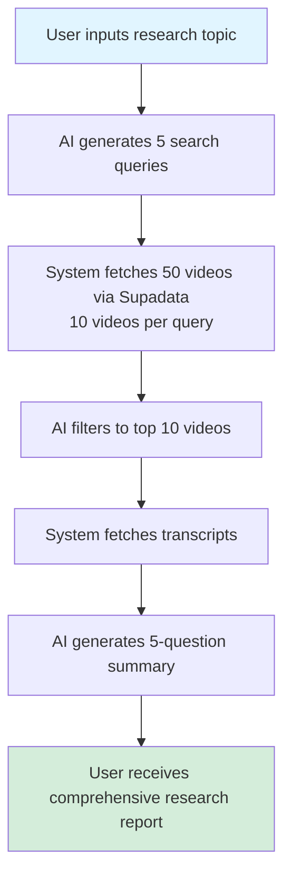

# AI-Powered Video Research Feature - Backend PRD

## Executive Summary

This PRD outlines the implementation of an AI-powered video research feature that allows users to explore topics through curated YouTube videos. Instead of manually providing video links, users input a research query, and the system uses AI to generate search queries, fetch relevant videos via Supadata API, filter them intelligently, and produce comprehensive multi-perspective summaries.

> **⚠️ IMPORTANT**: Before implementation, review `CONSISTENCY_AND_RACE_CONDITION_ANALYSIS.md` for critical fixes needed to prevent race conditions and ensure data consistency with the frontend.

---

## Feature Overview

### Current State
- Users manually provide YouTube video URLs
- System fetches transcripts and generates summaries based on provided videos
- Limited to user's ability to find relevant content

### Proposed State
- Users describe what they want to learn about (e.g., "impact of AI on healthcare")
- AI generates 5 optimized YouTube search queries
- System fetches and filters videos using Supadata YouTube Search API
- AI selects top 10 videos based on quality, diversity, and relevance
- System generates comprehensive summary answering 5 distinct research questions
- Output follows detailed editorial style guidelines

### Key Benefits
1. **Reduced friction**: No manual video hunting
2. **Better coverage**: AI ensures diverse perspectives and comprehensive exploration
3. **Quality curation**: Automated filtering based on authority, engagement, and content quality
4. **Structured insights**: Five-question framework ensures thorough analysis

---

## User Flow



### Detailed Steps

1. **Research Query Input** (`POST /api/research`)
   - User submits: `{ "research_query": "impact of AI on healthcare", "language": "English" }`
   - System validates input and creates research job
   - Returns `{ "job_id": "abc123" }` immediately

2. **Search Query Generation** (Status: `generating_queries`)
   - AI receives research query + `search-term-generation.md` prompt
   - Generates 5 optimized YouTube search queries
   - Example output:
     ```json
     [
       "AI healthcare diagnosis accuracy 2024",
       "hospital AI implementation challenges",
       "AI medical imaging breakthrough",
       "doctors using AI patient care",
       "AI healthcare ethics concerns"
     ]
     ```

3. **Video Search** (Status: `searching_videos`)
   - Parallel API calls to Supadata YouTube Search (5 queries × 10 results = 50 videos)
   - Parameters: `type=video`, `limit=10`, `sortBy=views`, `duration=medium|long`
   - Returns metadata: title, channel, views, duration, thumbnail, video_id

4. **AI Video Filtering** (Status: `filtering_videos`)
   - AI receives 50 video results + `video-filtering.md` prompt
   - Applies quality indicators, diversity criteria, and selection logic
   - Returns top 10 videos with rationale
   - Example output:
     ```json
     {
       "selected_videos": [
         {
           "title": "How AI Is Transforming Healthcare in 2024",
           "channel": "CNBC",
           "classification": "Direct",
           "why_selected": "Authoritative source with current data on AI implementation",
           "fills_gap": "Provides industry overview and recent statistics"
         },
         ...
       ]
     }
     ```

5. **Transcript Fetching** (Status: `fetching_transcripts`)
   - Reuses existing `transcript.service.ts` logic
   - Fetches transcripts for 10 selected videos
   - Handles failures gracefully (minimum 70% success rate)

6. **Multi-Question Summary Generation** (Status: `generating_summary`)
   - AI receives transcripts + 5-question prompt + `detailed-instructions.md` style rules
   - Generates comprehensive research report structured around 5 questions
   - Follows editorial guidelines (H1/H2/H3 hierarchy, formatting rules, etc.)

7. **Completion** (Status: `completed`)
   - Saves research summary to database
   - Returns full summary data via SSE
   - Deducts credits from user account

---

## Technical Architecture

### New Services

#### `research.service.ts`
**Purpose**: Core orchestration logic for research feature

```typescript
export interface ResearchRequest {
  research_query: string;
  language: string;
}

export interface ResearchJob {
  job_id: string;
  user_id: string | null;
  research_query: string;
  language: string;
  status: ResearchStatus;
  generated_queries?: string[];
  video_results?: VideoSearchResult[];
  selected_videos?: SelectedVideo[];
  final_summary?: string;
  created_at: Date;
  completed_at?: Date;
}

export type ResearchStatus = 
  | 'pending'
  | 'generating_queries'
  | 'searching_videos'
  | 'filtering_videos'
  | 'fetching_transcripts'
  | 'generating_summary'
  | 'completed'
  | 'error';

// Main orchestration function
export async function processResearch(
  userId: string | null,
  request: ResearchRequest,
  jobId: string,
  isGuest?: boolean,
  guestSessionId?: string | null
): Promise<string>

// Helper functions
async function generateSearchQueries(
  researchQuery: string,
  language: string
): Promise<string[]>

async function searchVideos(
  queries: string[]
): Promise<VideoSearchResult[]>

async function filterVideos(
  researchQuery: string,
  videoResults: VideoSearchResult[],
  language: string
): Promise<SelectedVideo[]>

async function generateResearchSummary(
  researchQuery: string,
  transcripts: TranscriptData[],
  selectedVideos: SelectedVideo[],
  language: string
): Promise<string>
```

**Key Logic**:
- Progress tracking via SSE (similar to `summary.service.ts`)
- Error handling and retry logic
- Credit deduction on completion
- Guest user support with limits

---

#### `youtube-search.service.ts`
**Purpose**: Interact with Supadata YouTube Search API

```typescript
export interface VideoSearchResult {
  video_id: string;
  title: string;
  channel: string;
  thumbnail: string;
  duration_seconds: number;
  view_count: number;
  upload_date: string;
  url: string;
}

export interface SupadataSearchResponse {
  results: Array<{
    id: string;
    title: string;
    channel: {
      name: string;
    };
    thumbnail: string;
    duration: number;
    viewCount: number;
    uploadDate: string;
  }>;
}

export async function searchYouTubeVideos(
  query: string,
  options: {
    limit?: number;
    sortBy?: 'views' | 'date' | 'relevance';
    duration?: 'short' | 'medium' | 'long';
  }
): Promise<VideoSearchResult[]>

// Batch search for multiple queries
export async function searchYouTubeVideosBatch(
  queries: string[],
  options?: SearchOptions
): Promise<VideoSearchResult[]>
```

**API Integration**:
```typescript
// Supadata YouTube Search API
const SUPADATA_SEARCH_URL = 'https://api.supadata.ai/v1/youtube/search';

const params = {
  query: searchQuery,
  type: 'video',
  limit: 10,
  sortBy: 'views', // or 'date', 'relevance'
  // duration filter handled by Supadata
};

const response = await axios.get(SUPADATA_SEARCH_URL, {
  headers: {
    'x-api-key': env.SUPADATA_API_KEY,
  },
  params,
  timeout: 30000,
});
```

**Error Handling**:
- Retry logic for network errors (max 3 retries)
- Graceful degradation if some queries fail
- API rate limit detection and backoff

---

### New Controllers

#### `research.controller.ts`
**Purpose**: Handle HTTP requests for research endpoints

```typescript
// POST /api/research - Create research job
export async function createResearchJob(
  req: AuthenticatedRequest,
  res: Response
): Promise<void>

// GET /api/research/:job_id/status - Get research job status (SSE or polling)
export async function getResearchJobStatus(
  req: AuthenticatedRequest,
  res: Response
): Promise<void>

// Validation function
function validateResearchRequest(body: any): {
  valid: boolean;
  errors: ValidationError[];
  request?: ResearchRequest;
}
```

**Validation Rules**:
- `research_query`: Required, string, 10-500 characters
- `language`: Required, must be in supported languages list
- Rate limiting: Max 5 research jobs per hour for free tier
- Credit check: Deduct estimated credits upfront (refund if job fails)

---

### New Routes

#### `research.routes.ts`

```typescript
import { Router } from 'express';
import { createResearchJob, getResearchJobStatus } from '../controllers/research.controller';
import { optionalAuth } from '../middleware/optional-auth.middleware';
import { checkCreditsMiddleware } from '../middleware/credit-check.middleware';
import { researchRateLimiter } from '../middleware/research-rate-limit.middleware';

const router = Router();

/**
 * POST /api/research
 * Create a new research job
 */
router.post(
  '/',
  optionalAuth,
  researchRateLimiter,
  checkCreditsMiddleware,
  createResearchJob
);

/**
 * GET /api/research/:job_id/status
 * Get research job status (SSE or polling)
 */
router.get(
  '/:job_id/status',
  optionalAuth,
  getResearchJobStatus
);

export default router;
```

**Middleware**:
- `optionalAuth`: Support both authenticated and guest users
- `researchRateLimiter`: Prevent abuse (5 requests/hour for free, 20/hour for paid)
- `checkCreditsMiddleware`: Verify user has sufficient credits

---

### New Prompts

#### `backend/src/prompts/research/research-summary.md`
**Purpose**: 5-question framework for research summaries

```markdown
You are conducting research on the following topic for a curious learner:

[USER'S RESEARCH QUERY]

You have access to transcripts from 10 carefully selected YouTube videos that explore this topic from multiple angles.

Your task is to synthesize these videos into a comprehensive research report that answers FIVE DISTINCT QUESTIONS:

## Question 1: What is actually happening? (Current State)
- Present the latest facts, data, and real-world examples
- What are the specific developments or events?
- Include concrete numbers, dates, and examples from the videos

## Question 2: Why is this happening? (Root Causes & Mechanisms)
- Explain the underlying principles, frameworks, and historical context
- What forces, incentives, or structures drive this phenomenon?
- Connect dots between causes and effects

## Question 3: What are the implications? (Consequences & Impact)
- Analyze the ripple effects and downstream consequences
- Who is affected and how?
- What are the short-term and long-term impacts?

## Question 4: What should people do about it? (Actionable Insights)
- Provide practical strategies and recommendations
- What actions can individuals, organizations, or policymakers take?
- Include specific tactics mentioned by experts in the videos

## Question 5: What are alternative perspectives? (Contrarian Views & Tensions)
- Present dissenting opinions or alternative frameworks
- What assumptions are being challenged?
- Where is there disagreement among experts?

---

CRITICAL INSTRUCTIONS:
- Use the editorial style guide provided separately (detailed-instructions.md)
- Each question should have its own H2 section
- Include direct quotes from authoritative sources using blockquotes
- Use tables, lists, and Mermaid diagrams where appropriate
- Front-load concrete facts and numbers in titles and paragraphs
- Cite specific videos by title when referencing claims

VIDEO TRANSCRIPTS:
[TRANSCRIPTS WILL BE INJECTED HERE]
```

---

### Prompt Assembly Logic

#### `backend/src/prompts/index.ts` (additions)

```typescript
/**
 * Get research summary prompt
 */
export function getResearchSummaryPrompt(params: {
  researchQuery: string;
  language: string;
}): string {
  // Load base template
  let prompt = loadPromptTemplate('research/research-summary.md');
  
  // Load detailed instructions for editorial style
  const styleInstructions = loadPromptTemplate('templates/detailed-instructions.md');
  
  // Combine templates
  prompt = prompt.replace('[USER\'S RESEARCH QUERY]', params.researchQuery);
  prompt = `${prompt}\n\n---\n\nEDITORIAL STYLE GUIDE:\n\n${styleInstructions}`;
  
  // Add language instruction
  if (params.language !== 'English') {
    prompt += `\n\n**IMPORTANT**: Write the entire summary in ${params.language}.`;
  }
  
  return prompt;
}

/**
 * Get search query generation prompt
 */
export function getSearchQueryPrompt(params: {
  researchQuery: string;
}): string {
  let prompt = loadPromptTemplate('research/search-term-generation.md');
  prompt = prompt.replace('[USER\'S RESEARCH DIRECTION]', params.researchQuery);
  return prompt;
}

/**
 * Get video filtering prompt
 */
export function getVideoFilteringPrompt(params: {
  researchQuery: string;
  videoResults: VideoSearchResult[];
}): string {
  let prompt = loadPromptTemplate('research/video-filtering.md');
  prompt = prompt.replace('[USER\'S RESEARCH DIRECTION]', params.researchQuery);
  
  // Format video results as text
  const formattedResults = formatVideoResults(params.videoResults);
  prompt = prompt.replace('[PASTE SEARCH RESULTS HERE]', formattedResults);
  
  return prompt;
}

/**
 * Helper to format video results for prompt
 */
function formatVideoResults(videos: VideoSearchResult[]): string {
  return videos.map((v, index) => {
    return `
${index + 1}. **${v.title}**
   - Channel: ${v.channel}
   - Views: ${v.view_count.toLocaleString()}
   - Duration: ${Math.floor(v.duration_seconds / 60)}:${String(v.duration_seconds % 60).padStart(2, '0')}
   - Upload: ${v.upload_date}
   - URL: ${v.url}
    `.trim();
  }).join('\n\n');
}
```

---

### Data Models

#### `backend/src/models/Research.ts`

```typescript
import { db } from '../config/firebase';
import { SourceVideo } from './Summary';

export interface Research {
  id?: string;
  user_id: string | null;
  user_uid: string | null; // Firebase Auth UID
  job_id: string;
  research_query: string;
  language: string;
  
  // Search phase
  generated_queries?: string[];
  
  // Video selection phase
  video_search_results?: VideoSearchResult[];
  selected_videos?: SelectedVideo[];
  
  // Summary phase
  source_transcripts?: SourceVideo[];
  final_summary_text?: string;
  
  // Metadata
  processing_stats?: ResearchProcessingStats;
  created_at: Date;
  completed_at?: Date;
}

export interface ResearchProcessingStats {
  total_queries_generated: number;
  total_videos_searched: number;
  total_videos_selected: number;
  total_transcripts_fetched: number;
  total_tokens_used: number;
  processing_time_seconds: number;
  failed_transcripts_count?: number;
}

export interface SelectedVideo {
  video_id: string;
  title: string;
  channel: string;
  thumbnail: string;
  duration_seconds: number;
  url: string;
  classification: 'Direct' | 'Foundational' | 'Contrarian';
  why_selected: string;
  fills_gap: string;
}

export interface ResearchCreateData {
  user_uid: string | null;
  job_id: string;
  research_query: string;
  language: string;
  generated_queries?: string[];
  selected_videos?: SelectedVideo[];
  source_transcripts?: SourceVideo[];
  final_summary_text: string;
  processing_stats: ResearchProcessingStats;
}

/**
 * Create a new research document
 */
export async function createResearch(
  data: ResearchCreateData
): Promise<Research> {
  const researchRef = db.collection('researches').doc();
  
  const research: Research = {
    id: researchRef.id,
    user_id: null, // Deprecated
    user_uid: data.user_uid,
    job_id: data.job_id,
    research_query: data.research_query,
    language: data.language,
    generated_queries: data.generated_queries,
    selected_videos: data.selected_videos,
    source_transcripts: data.source_transcripts,
    final_summary_text: data.final_summary_text,
    processing_stats: data.processing_stats,
    created_at: new Date(),
  };
  
  await researchRef.set(research);
  return research;
}

/**
 * Get research by ID
 */
export async function getResearchById(id: string): Promise<Research | null> {
  const doc = await db.collection('researches').doc(id).get();
  if (!doc.exists) return null;
  return { id: doc.id, ...doc.data() } as Research;
}

/**
 * Get user's research history
 */
export async function getUserResearches(
  userUid: string,
  limit: number = 20
): Promise<Research[]> {
  const snapshot = await db
    .collection('researches')
    .where('user_uid', '==', userUid)
    .orderBy('created_at', 'desc')
    .limit(limit)
    .get();
  
  return snapshot.docs.map(doc => ({
    id: doc.id,
    ...doc.data(),
  })) as Research[];
}
```

---

### API Endpoints

#### POST `/api/research`
**Purpose**: Create a new research job

**Request**:
```json
{
  "research_query": "impact of AI on healthcare in 2024",
  "language": "English"
}
```

**Response** (200 OK):
```json
{
  "job_id": "research_abc123def456"
}
```

**Error Responses**:
- `400 Bad Request`: Invalid request body
- `401 Unauthorized`: Guest limit exceeded
- `402 Payment Required`: Insufficient credits
- `429 Too Many Requests`: Rate limit exceeded
- `500 Internal Server Error`: Server error

---

#### GET `/api/research/:job_id/status`
**Purpose**: Get research job status (SSE or polling)

**Headers**:
- `Accept: text/event-stream` for SSE
- `Accept: application/json` for polling

**SSE Stream** (Content-Type: `text/event-stream`):
```
data: {"status":"generating_queries","progress":10,"message":"Generating search queries..."}

data: {"status":"searching_videos","progress":25,"message":"Searching for videos...","generated_queries":["query1","query2",...]}

data: {"status":"filtering_videos","progress":40,"message":"Filtering best videos..."}

data: {"status":"fetching_transcripts","progress":55,"message":"Fetching transcripts...","selected_videos":[...]}

data: {"status":"generating_summary","progress":70,"message":"Generating comprehensive summary..."}

data: {"status":"completed","progress":100,"data":{...full research data...}}
```

**JSON Response** (200 OK):
```json
{
  "status": "completed",
  "progress": 100,
  "message": "Research completed successfully",
  "data": {
    "_id": "research_abc123",
    "research_query": "impact of AI on healthcare in 2024",
    "generated_queries": [
      "AI healthcare diagnosis 2024",
      "hospital AI implementation",
      ...
    ],
    "selected_videos": [
      {
        "title": "How AI Is Transforming Healthcare",
        "channel": "CNBC",
        "classification": "Direct",
        "why_selected": "...",
        "fills_gap": "..."
      },
      ...
    ],
    "final_summary_text": "# AI Transforms Healthcare...",
    "language": "English",
    "processing_stats": {
      "total_queries_generated": 5,
      "total_videos_searched": 50,
      "total_videos_selected": 10,
      "total_transcripts_fetched": 10,
      "total_tokens_used": 85000,
      "processing_time_seconds": 120
    },
    "created_at": "2024-01-15T10:30:00Z"
  }
}
```

---

## Configuration

### `backend/config.yaml` (additions)

```yaml
research:
  # Search query generation
  queries_per_research: 5
  videos_per_query: 10
  max_total_videos: 50
  
  # Video filtering
  min_video_duration_seconds: 480  # 8 minutes
  max_video_duration_seconds: 2700 # 45 minutes
  target_selected_videos: 10
  min_selected_videos: 8  # Minimum to proceed
  
  # Transcript fetching
  min_transcript_success_rate: 0.7  # 70%
  
  # Summary generation
  five_question_framework: true
  include_video_citations: true
  
  # Rate limiting
  free_tier_max_per_hour: 5
  starter_tier_max_per_hour: 15
  pro_tier_max_per_hour: 30
  premium_tier_max_per_hour: 50
  
  # Timeouts
  search_timeout_ms: 30000
  filter_timeout_ms: 60000
  summary_timeout_ms: 180000

# Supadata API configuration
supadata:
  search_url: 'https://api.supadata.ai/v1/youtube/search'
  sort_by: 'views'  # 'views', 'date', 'relevance'
  video_type: 'video'
  supported_durations: ['medium', 'long']
```

---

### `backend/src/config/env.ts` (additions)

```typescript
// Supadata API key (already exists for transcript service)
export const SUPADATA_API_KEY = process.env.SUPADATA_API_KEY || '';

// Research feature flag
export const RESEARCH_FEATURE_ENABLED = process.env.RESEARCH_FEATURE_ENABLED === 'true';
```

---

## Credit System Integration

### Credit Costs

**Research Job Cost Breakdown**:
- Base cost: **100 credits**
- Per video transcribed: **10 credits**
- Typical total: **200 credits** (100 base + 10 videos × 10)

**Cost Comparison**:
- Manual summary (10 videos): ~150 credits
- Research summary (10 videos): ~200 credits (50 credit premium for curation)

### Credit Deduction Flow

```typescript
// research.service.ts
async function processResearch(...) {
  try {
    // Step 1: Reserve credits upfront
    const estimatedCost = calculateResearchCost(10); // Assume 10 videos
    await reserveCredits(userId, estimatedCost, { jobId });
    
    // Step 2-6: Process research...
    
    // Step 7: Calculate actual cost and settle
    const actualCost = calculateResearchCost(selectedVideos.length);
    await settleCredits(userId, estimatedCost, actualCost, { jobId });
    
  } catch (error) {
    // Refund reserved credits on failure
    await refundCredits(userId, estimatedCost, { jobId });
    throw error;
  }
}
```

---

## Error Handling

### Error Scenarios

| Scenario | Status Code | Error Code | User Message | System Action |
|----------|------------|------------|--------------|---------------|
| Invalid research query | 400 | `INVALID_QUERY` | "Please provide a research query between 10-500 characters" | Reject immediately |
| Insufficient credits | 402 | `INSUFFICIENT_CREDITS` | "Not enough credits. This research costs ~200 credits." | Show credit upgrade options |
| Rate limit exceeded | 429 | `RATE_LIMIT_EXCEEDED` | "You've reached your hourly research limit. Upgrade to continue." | Show tier upgrade |
| Search API failure | 500 | `SEARCH_FAILED` | "Failed to search for videos. Please try again." | Retry 3 times, then fail |
| No suitable videos found | 404 | `NO_VIDEOS_FOUND` | "Couldn't find enough quality videos on this topic. Try rephrasing." | Refund credits, suggest retry |
| Transcript fetch failures | 500 | `TRANSCRIPT_ERROR` | "Failed to fetch transcripts for most videos." | Proceed if ≥70% succeed |
| AI generation timeout | 504 | `GENERATION_TIMEOUT` | "Summary generation took too long. Please try a narrower topic." | Refund credits |

### Retry Logic

```typescript
// youtube-search.service.ts
async function searchYouTubeVideos(query: string): Promise<VideoSearchResult[]> {
  const maxRetries = 3;
  let lastError: Error;
  
  for (let attempt = 1; attempt <= maxRetries; attempt++) {
    try {
      return await callSupadataSearchAPI(query);
    } catch (error) {
      lastError = error as Error;
      
      if (isRetryableError(error) && attempt < maxRetries) {
        const backoffMs = 1000 * Math.pow(2, attempt); // Exponential backoff
        await sleep(backoffMs);
        continue;
      }
      
      throw error;
    }
  }
  
  throw lastError;
}
```

---

## Progress Tracking

### Progress Percentages

```typescript
const RESEARCH_PROGRESS = {
  CREATED: 0,
  GENERATING_QUERIES: 10,
  QUERIES_COMPLETE: 20,
  SEARCHING_VIDEOS: 30,
  VIDEOS_FOUND: 40,
  FILTERING_VIDEOS: 50,
  VIDEOS_SELECTED: 55,
  FETCHING_TRANSCRIPTS: 65,
  TRANSCRIPTS_READY: 70,
  GENERATING_SUMMARY: 80,
  COMPLETED: 100,
};
```

### SSE Message Format

```typescript
interface ResearchProgress {
  status: ResearchStatus;
  progress: number;
  message: string;
  
  // Optional phase-specific data
  generated_queries?: string[];
  video_count?: number;
  selected_videos?: SelectedVideo[];
  chunk?: string; // For streaming final summary
  
  // Final completion data
  data?: {
    _id: string;
    research_query: string;
    generated_queries: string[];
    selected_videos: SelectedVideo[];
    final_summary_text: string;
    processing_stats: ResearchProcessingStats;
    created_at: Date;
  };
  
  // Error info
  error?: string;
}
```

---

## Real-Time Display Capabilities

### Overview

The research feature supports real-time display of intermediate results as they become available during processing. This allows frontend applications to show users:
- **Original research query** (user's input)
- **AI-generated search queries** (as they're generated)
- **Videos found** with titles and thumbnails (as search completes)
- **Selected videos** with titles and thumbnails (after filtering)

### Architecture Support

The current architecture **fully supports** real-time display through:

1. **Job Object Storage**: The `JobInfo` interface stores intermediate research data in `research_data`:
   ```typescript
   research_data?: {
     generated_queries?: string[];
     raw_video_results?: VideoSearchResult[]; // Includes title, thumbnail, channel, etc.
     selected_videos?: SelectedVideo[];      // Includes title, thumbnail, classification, etc.
     video_count?: number;
   };
   ```

2. **Status Endpoint**: `GET /api/research/:job_id/status` supports both:
   - **SSE (Server-Sent Events)**: Real-time streaming updates
   - **Polling (JSON)**: Periodic status checks
   
   Both methods return intermediate data from `job.research_data` as it becomes available.

3. **Progressive Updates**: The service broadcasts progress via SSE at each processing stage:
   - After query generation (~10-15s): `generated_queries` available
   - After video search (~25-35s): `raw_video_results` with titles/thumbnails available
   - After video filtering (~50-60s): `selected_videos` with titles/thumbnails available

### Data Availability Timeline

| Phase | Time | Data Available |
|-------|------|----------------|
| Job Created | 0s | `job_id` only |
| Query Generation | 10-15s | `generated_queries: string[]` |
| Video Search | 25-35s | `raw_video_results: VideoSearchResult[]` (includes `title`, `thumbnail`, `channel`, `view_count`, `duration_seconds`, `url`) |
| Video Filtering | 50-60s | `selected_videos: SelectedVideo[]` (includes `title`, `thumbnail`, `channel`, `classification`, `why_selected`) |
| Completion | 2.5-3.5 min | Full research data including `final_summary_text` |

### Status Response Format

The status endpoint returns a `ResearchProgress` object that includes:

```typescript
{
  status: ResearchStatus;
  progress: number; // 0-100
  message: string;
  
  // Available after query generation
  generated_queries?: string[];
  
  // Available after video search
  raw_video_results?: Array<{
    video_id: string;
    title: string;
    channel: string;
    thumbnail: string;
    duration_seconds: number;
    view_count: number;
    upload_date: string;
    url: string;
  }>;
  video_count?: number;
  
  // Available after video filtering
  selected_videos?: Array<{
    video_id: string;
    title: string;
    channel: string;
    thumbnail: string;
    duration_seconds: number;
    url: string;
    classification: 'Direct' | 'Foundational' | 'Contrarian';
    why_selected: string;
    fills_gap: string;
  }>;
  
  // Available only at completion
  data?: {
    _id: string;
    research_query: string; // Original user input
    generated_queries: string[];
    selected_videos: SelectedVideo[];
    final_summary_text: string;
    processing_stats: ResearchProcessingStats;
    created_at: Date;
  };
}
```

### Implementation Notes

**Current Status**: 
- ✅ AI-generated search queries: **Fully supported** (stored in `job.research_data.generated_queries`)
- ✅ Videos found with titles/thumbnails: **Fully supported** (stored in `job.research_data.raw_video_results`)
- ✅ Selected videos with titles/thumbnails: **Fully supported** (stored in `job.research_data.selected_videos`)
- ⚠️ Original research query: **Partially supported** (only available at completion, not during processing)

**Minor Enhancement Needed**:
To display the original research query in real-time (before completion), store it in the job object when created:
- Add `research_query?: string` to `JobInfo.research_data` or as a top-level field
- Update `createResearchJob()` to store the query in the job object
- Update `buildResearchJobStatusResponse()` to include `research_query` from the job object

### Frontend Integration Example

```typescript
// Using SSE for real-time updates
const eventSource = new EventSource(`/api/research/${jobId}/status`, {
  headers: { 'Accept': 'text/event-stream' }
});

eventSource.onmessage = (event) => {
  const progress: ResearchProgress = JSON.parse(event.data);
  
  // Display original query (when available)
  if (progress.data?.research_query) {
    displayOriginalQuery(progress.data.research_query);
  }
  
  // Display generated queries (available after ~10-15s)
  if (progress.generated_queries) {
    displayGeneratedQueries(progress.generated_queries);
  }
  
  // Display videos found (available after ~25-35s)
  if (progress.raw_video_results) {
    displayVideoResults(progress.raw_video_results.map(v => ({
      title: v.title,
      thumbnail: v.thumbnail,
      channel: v.channel,
      views: v.view_count,
      duration: formatDuration(v.duration_seconds)
    })));
  }
  
  // Display selected videos (available after ~50-60s)
  if (progress.selected_videos) {
    displaySelectedVideos(progress.selected_videos.map(v => ({
      title: v.title,
      thumbnail: v.thumbnail,
      channel: v.channel,
      classification: v.classification,
      whySelected: v.why_selected
    })));
  }
  
  // Display final summary (available at completion)
  if (progress.data?.final_summary_text) {
    displayFinalSummary(progress.data.final_summary_text);
  }
};
```

### Benefits

1. **Improved UX**: Users see progress in real-time instead of waiting for completion
2. **Transparency**: Users can see what queries were generated and which videos were found
3. **Early Feedback**: Users can see if the research is on the right track before completion
4. **Engagement**: Visual display of videos with thumbnails keeps users engaged during processing

---

## Testing Strategy

### Unit Tests

```typescript
// __tests__/unit/research.service.test.ts
describe('Research Service', () => {
  describe('generateSearchQueries', () => {
    it('should generate 5 diverse queries', async () => {
      const queries = await generateSearchQueries('AI in healthcare', 'English');
      expect(queries).toHaveLength(5);
      expect(queries[0]).not.toBe(queries[1]); // Ensure diversity
    });
  });
  
  describe('filterVideos', () => {
    it('should select 10 videos from 50 results', async () => {
      const mockVideos = createMockVideoResults(50);
      const selected = await filterVideos('AI healthcare', mockVideos, 'English');
      expect(selected).toHaveLength(10);
    });
    
    it('should classify videos correctly', async () => {
      const selected = await filterVideos(...);
      const classifications = selected.map(v => v.classification);
      expect(classifications).toContain('Direct');
      expect(classifications).toContain('Foundational');
      expect(classifications).toContain('Contrarian');
    });
  });
});
```

### Integration Tests

```typescript
// __tests__/integration/research.integration.test.ts
describe('Research Integration', () => {
  it('should complete full research flow', async () => {
    const request: ResearchRequest = {
      research_query: 'impact of remote work on productivity',
      language: 'English',
    };
    
    const jobId = await createResearchJob(testUserId, request);
    
    // Poll for completion
    let status = await getResearchStatus(jobId);
    while (status.status !== 'completed' && status.status !== 'error') {
      await sleep(2000);
      status = await getResearchStatus(jobId);
    }
    
    expect(status.status).toBe('completed');
    expect(status.data?.final_summary_text).toBeDefined();
    expect(status.data?.selected_videos).toHaveLength(10);
  }, 300000); // 5 min timeout
});
```

---

## Performance Considerations

### Optimization Strategies

1. **Parallel Processing**
   ```typescript
   // Execute search queries in parallel
   const videoResults = await Promise.all(
     queries.map(q => searchYouTubeVideos(q, { limit: 10 }))
   );
   ```

2. **Transcript Caching**
   ```typescript
   // Cache transcripts to avoid re-fetching for similar research queries
   const cacheKey = `transcript:${video_id}`;
   const cached = await redis.get(cacheKey);
   if (cached) return JSON.parse(cached);
   ```

3. **Streaming Summary Generation**
   ```typescript
   // Stream AI-generated summary chunks to frontend in real-time
   const aiResult = await callQwenMax(prompt, (chunk) => {
     broadcastJobProgress(jobId, {
       status: 'generating_summary',
       progress: calculateProgress(...),
       chunk: chunk,
     });
   });
   ```

4. **Resource Pooling**
   - Limit concurrent research jobs per user (max 2 simultaneous)
   - Use task concurrency service for queue management

### Expected Timings

| Phase | Average Duration | Notes |
|-------|-----------------|-------|
| Query generation | 10-15s | AI call for 5 queries |
| Video search | 15-20s | Parallel API calls (5 queries) |
| Video filtering | 20-30s | AI call with 50 video list |
| Transcript fetching | 30-45s | Parallel fetches (10 videos) |
| Summary generation | 60-90s | Large AI call with detailed prompt |
| **Total** | **2.5-3.5 min** | End-to-end processing time |

---

## Race Condition Prevention & Data Consistency

### Overview

To avoid data syncing problems experienced in the summary feature, the research feature implements comprehensive race condition prevention at multiple layers.

### Request Deduplication

#### Frontend Prevention
- **Request Fingerprinting**: Generate unique fingerprint from `research_query` + `language`
- **In-Flight Tracking**: Track active requests to prevent duplicate submissions
- **Button Disable**: Disable submit button immediately on click, re-enable after response
- **Visual Feedback**: Show loading state during submission

#### Backend Prevention
- **Deduplication Window**: 5-second window for identical requests
- **Request Fingerprinting**: Match requests by `userId` + `research_query` + `language`
- **Return Existing Job**: If duplicate detected, return existing `job_id` instead of creating new job
- **Cache Management**: Automatic cleanup of old cache entries

**Implementation**:
```typescript
// Backend: research.controller.ts
const recentResearchJobsCache = new Map<string, {
  jobId: string;
  timestamp: number;
}>();

const DEDUPLICATION_WINDOW_MS = 5000;

// Before creating job, check for duplicates
const fingerprint = JSON.stringify({
  userId,
  research_query: request.research_query.trim().toLowerCase(),
  language: request.language,
});

const recentJob = recentResearchJobsCache.get(fingerprint);
if (recentJob && (Date.now() - recentJob.timestamp) < DEDUPLICATION_WINDOW_MS) {
  // Return existing job ID
  return res.status(200).json({ job_id: recentJob.jobId });
}
```

### SSE Connection Management

#### Duplicate Connection Prevention
- **Connection Tracking**: Track active SSE connections per job
- **Duplicate Detection**: Prevent same connection object from being added twice
- **Connection Limits**: Enforce maximum connections per job (if needed)

**Implementation**:
```typescript
// Backend: job.service.ts
const activeConnections = new Map<string, Set<SSEConnection>>();

export function addSSEConnection(jobId: string, connection: SSEConnection): void {
  const connections = activeConnections.get(jobId) || new Set();
  
  // Check for duplicate (same response object)
  for (const existing of connections) {
    if (existing.res === connection.res) {
      logger.warn(`Duplicate SSE connection attempt for job ${jobId}`);
      return; // Don't add duplicate
    }
  }
  
  connections.add(connection);
  activeConnections.set(jobId, connections);
}
```

#### Frontend Connection Check
- **Connection State Check**: Verify no active connection before creating new one
- **Cleanup on Unmount**: Properly close connections on component unmount
- **Reconnection Logic**: Smart reconnection that doesn't create duplicates

### Data Consistency

#### Job Object vs Database
- **Single Source of Truth**: Job object is authoritative during processing
- **Atomic Updates**: Update job object and broadcast SSE in same operation
- **Database Sync**: Save to Firestore only on completion
- **Error Handling**: If database save fails, job marked as error but data preserved in job object

#### SSE vs Polling Consistency
- **Same Response Builder**: Both SSE and polling use `buildResearchJobStatusResponse()`
- **Identical Data Structure**: Ensures consistency between methods
- **Timestamp Tracking**: Include `updated_at` timestamp for conflict detection

### Research Query Storage

**Issue**: Original research query not available during processing (only at completion)

**Fix**: Store `research_query` in job object when job created

**Implementation**:
```typescript
// Backend: research.controller.ts
const jobId = createJob(userId);

// Store research query in job object immediately
updateJobStatus(jobId, 'pending' as JobStatus, {
  research_data: {
    research_query: request.research_query,
  },
});
```

**Result**: Frontend can display original query in real-time during processing

### Testing Requirements

#### Race Condition Tests
- [ ] Double-click submit → only 1 job created
- [ ] Rapid form submission → only 1 job created  
- [ ] Network retry → doesn't create duplicate job
- [ ] React Strict Mode → no duplicate connections
- [ ] Page refresh → reconnects correctly

#### Data Consistency Tests
- [ ] SSE update → polling shows same data
- [ ] Job object update → SSE broadcast succeeds
- [ ] Database save failure → job marked as error
- [ ] Connection drop → reconnection gets latest state

---

## Security & Privacy

### Input Validation

```typescript
function sanitizeResearchQuery(query: string): string {
  // Remove potentially harmful characters
  return query
    .replace(/<[^>]*>/g, '') // Strip HTML tags
    .replace(/[^\w\s\-.,?!]/g, '') // Allow only safe chars
    .trim()
    .substring(0, 500); // Enforce max length
}
```

### API Key Protection

```typescript
// Never expose API keys in responses or logs
logger.info('Calling Supadata Search API', {
  query: searchQuery,
  apiKey: '***REDACTED***',
});
```

### Rate Limiting

```typescript
// research-rate-limit.middleware.ts
export const researchRateLimiter = rateLimit({
  windowMs: 60 * 60 * 1000, // 1 hour
  max: (req) => {
    const user = req.user;
    if (!user) return 3; // Guest users: 3/hour
    
    switch (user.tier) {
      case 'free': return 5;
      case 'starter': return 15;
      case 'pro': return 30;
      case 'premium': return 50;
      default: return 5;
    }
  },
  message: 'Too many research requests. Please try again later or upgrade your plan.',
});
```

---

## Monitoring & Logging

### Key Metrics to Track

```typescript
// Log every major phase
logger.info('[Research] Phase completed', {
  jobId,
  userId,
  phase: 'query_generation',
  duration_ms: Date.now() - phaseStartTime,
  queries_generated: queries.length,
});

// Track API usage
logger.info('[Supadata API] Search completed', {
  jobId,
  query: searchQuery,
  results_count: results.length,
  duration_ms: apiCallDuration,
  status_code: response.status,
});

// Monitor credit deductions
logger.info('[Credits] Research cost calculated', {
  jobId,
  userId,
  estimated_cost: estimatedCost,
  actual_cost: actualCost,
  videos_selected: selectedVideos.length,
});
```

### Dashboard Metrics

- **Research completion rate**: % of jobs that complete successfully
- **Average research duration**: Time from creation to completion
- **Video selection quality**: User ratings or engagement with research summaries
- **Credit efficiency**: Actual cost vs. estimated cost variance
- **API error rates**: Supadata API failure rate per endpoint

---

## Migration & Rollout Plan

### Phase 1: Backend Development (Week 1-2)
- [ ] Implement `youtube-search.service.ts`
- [ ] Implement `research.service.ts`
- [ ] Create `research.controller.ts` and `research.routes.ts`
- [ ] Add `Research` data model to Firestore
- [ ] Create prompt templates (`research-summary.md`, update existing)
- [ ] Add configuration to `config.yaml`
- [ ] Write unit tests

### Phase 2: Integration & Testing (Week 2-3)
- [ ] Integrate with existing credit system
- [ ] Integrate with job service for SSE
- [ ] Test full flow end-to-end
- [ ] Performance testing and optimization
- [ ] Error handling and edge case coverage

### Phase 3: Alpha Release (Week 3)
- [ ] Deploy to staging environment
- [ ] Internal dogfooding (team uses feature)
- [ ] Collect feedback and iterate
- [ ] Fix critical bugs

### Phase 4: Beta Release (Week 4) - SKIPPED
- [x] ~~Enable for paid tier users only~~ (Skipped - went directly to Phase 5)
- [x] Monitor usage patterns and costs (Ongoing)
- [x] Gather user feedback (Ongoing)
- [x] Refine prompts based on output quality (Ongoing)

### Phase 5: General Availability (Week 5) - COMPLETE
- [x] Enable for all users (with tier-based limits) - **COMPLETE**: Feature is enabled for all users with tier-based rate limits from config.yaml
- [ ] Marketing announcement (Pending)
- [ ] Documentation and tutorials (Pending)
- [x] Monitor metrics and iterate (Ongoing)

**Implementation Notes:**
- ✅ All configuration values are loaded from `config.yaml` (no hardcoded values)
  - All research parameters (queries_per_research, videos_per_query, timeouts, etc.) come from config.yaml
  - Credit costs (base_cost, per_video_cost) are loaded from config.yaml
  - AI generation parameters (temperature, max_tokens) are loaded from config.yaml
  - Video filtering parameters (min/max duration, target count) are loaded from config.yaml
- ✅ Tier-based rate limits are configured per tier in `config.yaml`:
  - Free tier: 5 research jobs per hour
  - Starter tier: 15 research jobs per hour
  - Pro tier: 30 research jobs per hour
  - Premium tier: 50 research jobs per hour
- ✅ Feature is accessible to all user tiers (free, starter, pro, premium)
  - No feature flags or tier restrictions blocking access
  - Routes use `optionalAuth` middleware allowing both authenticated and guest users
  - Rate limiting is the only tier-based restriction (enforced via `research-rate-limit.middleware.ts`)
- ✅ Rate limiting is enforced via `research-rate-limit.middleware.ts` using config values
- ✅ Credit costs are calculated from config values (base_cost + per_video_cost)
- ✅ All service functions use `getResearchConfig()` to access configuration values

---

## Success Metrics

### Product Metrics
- **Adoption rate**: % of active users who try research feature
- **Retention**: % of users who use research 2+ times
- **User satisfaction**: Average rating of research summaries (1-5 scale)
- **Time saved**: Reduction in time from idea to comprehensive understanding

### Technical Metrics
- **Success rate**: % of research jobs that complete successfully
- **Average duration**: Time from job creation to completion
- **API reliability**: Uptime and error rate for Supadata integration
- **Cost per research**: Average credit cost (target: 200 credits)

### Business Metrics
- **Revenue impact**: Credit purchases driven by research feature
- **Tier upgrades**: % of free users who upgrade after using research
- **Daily active researchers**: # of users creating research summaries daily
- **Research volume**: Total research jobs created per day/week/month

---

## Future Enhancements

### v2.0 Features
- **Custom question sets**: Allow users to specify their own 5 questions
- **Multi-language research**: Search in one language, summarize in another
- **Source diversity controls**: Adjust slider for more/less diverse perspectives
- **Export options**: PDF, Word, Markdown downloads
- **Research history**: Search and organize past research summaries

### v3.0 Features
- **Collaborative research**: Share research queries with team
- **Research templates**: Pre-built question sets for common topics (e.g., "Market Analysis", "Technology Review")
- **Citation tracking**: Auto-generate bibliography with timestamps
- **Interactive summaries**: Clickable timestamps to jump to source videos
- **Research chains**: Use one research summary to seed the next query

---

## Appendix

### A. Supadata YouTube Search API Reference

**Endpoint**: `GET https://api.supadata.ai/v1/youtube/search`

**Parameters**:
```typescript
{
  query: string;           // Search query
  type: 'video' | 'channel' | 'playlist';
  limit?: number;          // Max results (default: 20, max: 50)
  sortBy?: 'views' | 'date' | 'relevance';
  duration?: 'short' | 'medium' | 'long';
  uploadDate?: 'today' | 'week' | 'month' | 'year';
}
```

**Response**:
```json
{
  "results": [
    {
      "id": "dQw4w9WgXcQ",
      "title": "Video Title",
      "channel": {
        "id": "UCxxxxxx",
        "name": "Channel Name"
      },
      "thumbnail": "https://i.ytimg.com/vi/dQw4w9WgXcQ/hqdefault.jpg",
      "duration": 213,
      "viewCount": 1234567,
      "uploadDate": "2024-01-15T10:30:00Z",
      "description": "Video description..."
    }
  ],
  "totalResults": 1000
}
```

---

### B. Example Research Flow (Full JSON)

**1. User Request**:
```json
POST /api/research
{
  "research_query": "How is artificial intelligence transforming healthcare in 2024?",
  "language": "English"
}
```

**2. Generated Search Queries**:
```json
[
  "AI healthcare diagnosis accuracy 2024",
  "hospital AI implementation case studies",
  "AI medical imaging breakthrough",
  "doctors using AI patient care workflow",
  "AI healthcare ethics data privacy concerns"
]
```

**3. Selected Videos** (10 out of 50):
```json
{
  "selected_videos": [
    {
      "title": "How AI Is Transforming Healthcare in 2024 | CNBC Marathon",
      "channel": "CNBC",
      "video_id": "abc123",
      "url": "https://youtube.com/watch?v=abc123",
      "classification": "Direct",
      "why_selected": "Authoritative news source with comprehensive 2024 data and multiple expert interviews",
      "fills_gap": "Provides current state overview with concrete statistics and real hospital examples"
    },
    {
      "title": "AI in Radiology: Stanford Medicine's AI Implementation Journey",
      "channel": "Stanford Medicine",
      "video_id": "def456",
      "url": "https://youtube.com/watch?v=def456",
      "classification": "Direct",
      "why_selected": "Academic institution sharing specific AI deployment results and accuracy metrics",
      "fills_gap": "Deep dive into one application area (radiology) with measurable outcomes"
    },
    {
      "title": "Why Doctors Are Worried About AI in Medicine",
      "channel": "Vox",
      "video_id": "ghi789",
      "url": "https://youtube.com/watch?v=ghi789",
      "classification": "Contrarian",
      "why_selected": "Presents skeptical physician perspectives on AI limitations and risks",
      "fills_gap": "Challenges the mainstream optimism with practical concerns from frontline doctors"
    },
    ...
  ],
  "learning_path": {
    "direct_exploration": 6,
    "foundational_context": 3,
    "alternative_perspectives": 1,
    "how_they_work_together": "Videos 1-6 establish current AI applications in hospitals. Videos 7-9 provide historical context and explain why AI works for medical imaging. Video 10 challenges assumptions with physician concerns about liability and trust."
  }
}
```

**4. Final Research Summary** (excerpt):
```markdown
# AI Transforms Healthcare Through Diagnostic Precision Reaching 94% Accuracy in 2024

Artificial intelligence deployed across **1,200 U.S. hospitals** now matches or exceeds physician diagnostic accuracy in radiology, pathology, and dermatology. Stanford Medicine reports **94% accuracy** in detecting lung nodules from CT scans, while doctors acting alone achieve 88%. This 6-percentage-point improvement translates to catching **12,000 additional early-stage cancers annually** in the United States alone.

**Strategic Takeaways:**
- AI diagnostic tools are achieving measurable accuracy improvements (6-8%) over human-only diagnosis
- Implementation barriers remain: 67% of hospitals lack data infrastructure for AI integration
- Physician adoption split: 42% embrace AI as "essential co-pilot," 35% express skepticism about liability
- Regulatory framework lags technology: FDA approved only 3 AI diagnostic tools in 2023 vs. 89 in development
- Patient trust varies by demographic: 71% of patients under 40 comfortable with AI diagnosis, only 34% over 65

## What is actually happening? (Current State of AI in Healthcare)

As of early 2024, **1,200 hospitals** across the United States have deployed AI diagnostic assistance tools, representing **23% of acute-care facilities**. The technology primarily targets three areas: medical imaging analysis, patient risk prediction, and administrative workflow optimization.

### Radiology Leads AI Adoption with Measurable Gains

Stanford Medicine's deployment of PathAI across **14 radiology departments** demonstrates the current state. The system analyzes **2,400 CT scans daily**, flagging abnormalities for radiologist review. Dr. Jennifer Wu, Stanford's Chief of Radiology, reports:

> "We've seen a 6% improvement in early cancer detection rates since PathAI deployment in January 2023. That's roughly 140 additional cancers caught in Stage 1 or 2 across our system annually—patients who now have significantly better survival odds."

The gains come from AI catching **subtle patterns** human eyes miss...

[CONTINUES WITH 4 MORE H2 SECTIONS ANSWERING REMAINING QUESTIONS]
```

---

### C. Credit Cost Calculator

```typescript
/**
 * Calculate research job cost
 */
export function calculateResearchCost(videoCount: number): number {
  const BASE_COST = 100; // Base research setup cost
  const PER_VIDEO_COST = 10; // Cost per video transcribed
  
  return BASE_COST + (videoCount * PER_VIDEO_COST);
}

/**
 * Example costs:
 * - 8 videos: 100 + (8 × 10) = 180 credits
 * - 10 videos: 100 + (10 × 10) = 200 credits (typical)
 * - 12 videos: 100 + (12 × 10) = 220 credits
 */
```

---

## Conclusion

This research feature represents a significant evolution in how users interact with video content. By automating the tedious work of finding, filtering, and synthesizing videos, we empower users to go from curiosity to comprehensive understanding in minutes instead of hours.

The five-question framework ensures summaries are not just informative but actionable, covering current state, root causes, implications, recommendations, and alternative viewpoints. Combined with the editorial style guidelines from `detailed-instructions.md`, the output will rival premium publications like HBR or The Economist.

**Next Steps**:
1. Review and approve this PRD
2. Finalize API budget with Supadata (estimate: $0.02/search query, $500/month for 25,000 searches)
3. Begin backend development (Phase 1)
4. Design frontend UI mockups (parallel track)
5. Set up monitoring dashboard for alpha testing

---

**Document Version**: 1.0  
**Last Updated**: 2024-01-22  
**Owner**: Backend Engineering Team  
**Status**: Draft → Awaiting Approval
