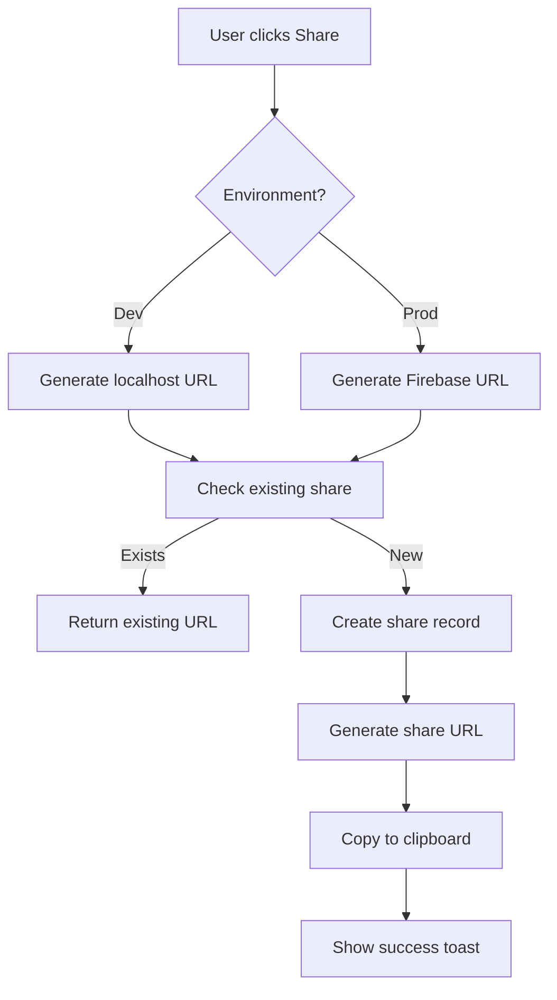

# Product Requirements Document: Research/Summary Sharing Feature

**Version:** 1.0  
**Date:** January 29, 2026  
**Status:** Draft for Review  
**Author:** Product Development Team

---

## Executive Summary

This PRD outlines the requirements and implementation plan for a **Share Feature** that enables users to generate and distribute shareable links for their research summaries. The feature allows anyone with the link to view the research/summary in a read-only format, facilitating collaboration and knowledge distribution.

### Key Objectives
- Enable users to share research findings with non-registered users
- Provide persistent, reusable shareable links to conserve server resources
- Ensure seamless functionality across development and production environments
- Maintain security while allowing public access to shared content

---

## 1. Product Overview

### 1.1 Problem Statement

Currently, users can only copy research summaries to their clipboard. There's no way to share research findings with collaborators, stakeholders, or team members who don't have accounts or access to the application. This limits the utility of the research tool and creates friction in knowledge sharing workflows.

### 1.2 Proposed Solution

Implement a **Share** button alongside the existing Copy button that:
1. Generates a unique, persistent shareable link for each research/summary
2. Stores sharing metadata to enable link reuse
3. Provides a public, read-only view of the shared content
4. Automatically handles environment-specific URL generation (localhost vs. production)

### 1.3 Success Metrics

- **Adoption Rate**: % of users who use the share feature within first 30 days
- **Share Completion Rate**: % of generated links that are actually accessed
- **Link Reuse Rate**: Average number of times a link is shared vs. generated
- **Performance**: Public page load time < 2 seconds
- **Resource Efficiency**: Zero duplicate share records for same research

---

## 2. User Stories

### Primary User Stories

**US-1: Share Research**  
*As a user, I want to share my research findings via a link so that colleagues can view my results without logging in.*

**Acceptance Criteria:**
- Share button visible next to Copy button in research summary view
- Clicking Share generates a unique link
- Link is automatically copied to clipboard
- User receives visual confirmation (toast notification)
- Link remains functional indefinitely

**US-2: View Shared Research**  
*As a recipient, I want to view shared research via a link so that I can understand the findings without needing an account.*

**Acceptance Criteria:**
- Link opens a read-only view of the research
- No authentication required
- Content displays identically to original (videos, summaries, metadata)
- Mobile-responsive design
- Clear indication that it's a shared view (no edit capabilities)

**US-3: Reuse Share Links**  
*As a user, I want to generate the same link each time I click Share for a specific research so that I don't create duplicate resources.*

**Acceptance Criteria:**
- First Share click creates new link and share record
- Subsequent Share clicks return existing link
- User is notified if link already exists
- Option to regenerate/revoke link (future consideration)

### Secondary User Stories

**US-4: Environment-Aware Link Generation**  
*As a developer/user, I want links to work correctly in both development and production so that testing is seamless.*

**Acceptance Criteria:**
- Dev environment uses `http://localhost:3000/shared/[shareId]`
- Production uses Firebase hosting URL: `https://[project-id].web.app/shared/[shareId]`
- Environment detection is automatic

**US-5: Share Analytics (Future)**  
*As a user, I want to see how many times my shared link has been viewed so that I can understand engagement.*

---

## 3. Functional Requirements

### 3.1 Core Features

#### 3.1.1 Share Button UI
- **Location**: Adjacent to Copy button in research summary header
- **Icon**: Share icon (standard share symbol)
- **Label**: "Share" with optional tooltip
- **States**: 
  - Default: Regular share icon
  - Hover: Highlighted state
  - Loading: Spinner while generating link
  - Success: Checkmark briefly, then return to default

#### 3.1.2 Share Link Generation

**Generation Logic:**
```typescript
interface ShareRecord {
  id: string;                    // Unique share ID (e.g., nanoid(10))
  researchId: string;            // Original research ID
  userId: string;                // Owner user ID
  createdAt: number;             // Unix timestamp
  lastAccessedAt?: number;       // Last view timestamp
  accessCount: number;           // View counter
  isActive: boolean;             // Revocation flag
  expiresAt?: number;            // Optional expiration (null = permanent)
}
```

**URL Structure:**
- Development: `http://localhost:3000/shared/[shareId]`
- Production: `https://video-research-40c4b.web.app/shared/[shareId]`

**ID Generation:**
- Use `nanoid` or similar for collision-resistant, short IDs (10-12 characters)
- Example: `shared/aB3xK9pQw2`

#### 3.1.3 Backend API Endpoints

**POST /api/research/:researchId/share**
- **Auth**: Required (authenticated user)
- **Purpose**: Generate or retrieve existing share link
- **Request Body**: None (researchId from URL params)
- **Response**:
  ```json
  {
    "success": true,
    "data": {
      "shareId": "aB3xK9pQw2",
      "shareUrl": "https://video-research-40c4b.web.app/shared/aB3xK9pQw2",
      "isNew": false,
      "createdAt": 1738176000000
    }
  }
  ```
- **Errors**:
  - `404`: Research not found
  - `403`: User doesn't own research
  - `500`: Server error

**GET /api/shared/:shareId**
- **Auth**: Not required (public endpoint)
- **Purpose**: Retrieve shared research data
- **Response**:
  ```json
  {
    "success": true,
    "data": {
      "research": { /* full research object */ },
      "metadata": {
        "sharedBy": "User Name (optional)",
        "sharedAt": 1738176000000,
        "viewCount": 142
      }
    }
  }
  ```
- **Errors**:
  - `404`: Share link not found or expired
  - `410`: Share link revoked

**DELETE /api/research/:researchId/share** (Future Phase)
- **Auth**: Required
- **Purpose**: Revoke a share link
- **Response**: `{ "success": true }`

#### 3.1.4 Frontend Share Page

**Route**: `/shared/[shareId]`

**Features:**
1. **Public Layout**: Minimal navigation, no auth UI
2. **Read-Only Content**: Full research display without edit capabilities
3. **Branding**: App logo/name at top
4. **Footer Attribution**: "Shared via [App Name]" + link to sign up
5. **Share CTA**: "Create your own research" button (marketing opportunity)
6. **Metadata Display**:
   - Research query/title
   - Generated date
   - Language
   - Video count
   - Optional: "Shared by [User]" if user opts in

**Page Structure**:
```tsx
<SharedResearchPage>
  <PublicHeader />
  <ResearchQuery />
  <ResearchSummary readOnly />
  <VideoGrid readOnly />
  <PublicFooter />
</SharedResearchPage>
```

### 3.2 Data Storage

#### 3.2.1 Storage Strategy

**Option A: Firestore Collection (Recommended)**
```
Collection: shared_links
Document ID: shareId (e.g., "aB3xK9pQw2")
Fields:
  - researchId: string
  - userId: string
  - createdAt: timestamp
  - lastAccessedAt: timestamp
  - accessCount: number
  - isActive: boolean
  - expiresAt: timestamp | null
```

**Indexes Required:**
- `researchId` (for lookup of existing shares)
- `userId` (for user's share management)
- `isActive + expiresAt` (for cleanup queries)

**Option B: Local JSON (Dev Mode Only)**
- Store in `backend/data/shared/[shareId].json`
- Mirror Firestore structure
- Auto-sync to Firestore in production

#### 3.2.2 Data Lifecycle

1. **Creation**: User clicks Share → Check if share exists → Create if new
2. **Access**: Anyone visits link → Increment `accessCount` → Update `lastAccessedAt`
3. **Cleanup** (Future): Cron job deletes expired or inactive shares

### 3.3 Environment Handling

#### 3.3.1 Environment Detection

**Backend Configuration:**
```typescript
// backend/src/config/env.ts
export const ENVIRONMENT = {
  NODE_ENV: process.env.NODE_ENV || 'development',
  IS_DEV: process.env.NODE_ENV === 'development',
  FRONTEND_URL: process.env.NODE_ENV === 'development' 
    ? 'http://localhost:3000'
    : process.env.FRONTEND_URL || 'https://video-research-40c4b.web.app'
};
```

**Frontend Configuration:**
```typescript
// frontend/src/config/env.ts
export const getShareBaseUrl = () => {
  if (typeof window === 'undefined') return ''; // SSR safety
  
  if (process.env.NODE_ENV === 'development') {
    return 'http://localhost:3000/shared';
  }
  
  // Production: use window.location.origin or env variable
  return `${window.location.origin}/shared`;
};
```

#### 3.3.2 URL Generation Flow



---

## 4. Non-Functional Requirements

### 4.1 Performance
- Share link generation: < 500ms
- Public page load time: < 2 seconds
- Database query optimization for share lookups

### 4.2 Security
- Rate limiting on share creation: 10 shares per user per hour
- Public endpoint rate limiting: 100 requests per IP per hour
- No sensitive user data exposed in shared view
- Prevent enumeration attacks with random IDs
- Optional: CAPTCHA for high-traffic shared links (future)

### 4.3 Scalability
- Support 10,000+ concurrent shared link accesses
- Firestore read optimization (cache research data)
- CDN caching for static shared pages (future)

### 4.4 Privacy
- Users can opt-in to show name on shared research
- Default: Anonymous sharing
- Shared research excludes: user email, full user profile, credits info

### 4.5 Accessibility
- WCAG 2.1 AA compliance for shared page
- Keyboard navigation support
- Screen reader friendly
- Color contrast ratios meet standards

### 4.6 SEO (Future Consideration)
- Meta tags for link previews (Open Graph, Twitter Cards)
- Dynamic title/description based on research query
- `noindex` for shared pages to avoid duplicate content issues

---

## 5. Technical Architecture

### 5.1 System Components

```
┌─────────────────────────────────────────────────────┐
│                    Frontend (Next.js)                │
│  ┌──────────────────────────────────────────────┐   │
│  │  Research Summary Page                        │   │
│  │  - Copy Button                                │   │
│  │  - [NEW] Share Button                         │   │
│  └─────────────┬────────────────────────────────┘   │
│                │ Click Share                         │
│  ┌─────────────▼────────────────────────────────┐   │
│  │  Share Modal/Toast                            │   │
│  │  - Shows generated link                       │   │
│  │  - Auto-copy to clipboard                     │   │
│  └──────────────────────────────────────────────┘   │
│                                                       │
│  ┌──────────────────────────────────────────────┐   │
│  │  /shared/[shareId] Page (NEW)                 │   │
│  │  - Public, no auth                            │   │
│  │  - Read-only research view                    │   │
│  └──────────────────────────────────────────────┘   │
└────────────────────┬────────────────────────────────┘
                     │ API Calls
┌────────────────────▼────────────────────────────────┐
│                Backend (Express)                     │
│  ┌──────────────────────────────────────────────┐   │
│  │  POST /api/research/:id/share                 │   │
│  │  - Check existing share                       │   │
│  │  - Create new if needed                       │   │
│  │  - Return share URL                           │   │
│  └────────────┬─────────────────────────────────┘   │
│               │                                      │
│  ┌────────────▼─────────────────────────────────┐   │
│  │  GET /api/shared/:shareId                     │   │
│  │  - Fetch share record                         │   │
│  │  - Fetch research data                        │   │
│  │  - Increment access count                     │   │
│  │  - Return public data                         │   │
│  └────────────┬─────────────────────────────────┘   │
└────────────────┬────────────────────────────────────┘
                 │ Database Queries
┌────────────────▼────────────────────────────────────┐
│              Firebase Firestore                      │
│  ┌──────────────────────────────────────────────┐   │
│  │  shared_links Collection                      │   │
│  │  - shareId → researchId mapping               │   │
│  │  - Access tracking                            │   │
│  │  - Expiration management                      │   │
│  └──────────────────────────────────────────────┘   │
│                                                      │
│  ┌──────────────────────────────────────────────┐   │
│  │  research Collection (existing)               │   │
│  │  - Full research data                         │   │
│  └──────────────────────────────────────────────┘   │
└─────────────────────────────────────────────────────┘
```

### 5.2 Data Flow Diagrams

#### 5.2.1 Share Creation Flow

```
User → Frontend → Backend → Firestore
 │                  │
 ├─ Click Share     │
 │                  ├─ POST /api/research/:id/share
 │                  │
 │                  ├─ Query: shared_links.where(researchId, ==, :id)
 │                  │
 │                  ├─ If exists: Return existing URL
 │                  │
 │                  ├─ If not exists:
 │                  │   ├─ Generate shareId (nanoid)
 │                  │   ├─ Create Firestore document
 │                  │   └─ Return new URL
 │                  │
 │ ◄────────────────┤ Response: { shareUrl, shareId, isNew }
 │                  │
 ├─ Copy to clipboard
 └─ Show toast: "Link copied!"
```

#### 5.2.2 Share Access Flow

```
Visitor → Frontend → Backend → Firestore
  │                   │
  ├─ Visit /shared/abc123
  │                   │
  │                   ├─ GET /api/shared/abc123
  │                   │
  │                   ├─ Query: shared_links.doc(abc123)
  │                   │
  │                   ├─ If not found: 404 Error
  │                   │
  │                   ├─ If expired/revoked: 410 Error
  │                   │
  │                   ├─ Fetch research data by researchId
  │                   │
  │                   ├─ Update: accessCount++, lastAccessedAt
  │                   │
  │ ◄─────────────────┤ Response: { research, metadata }
  │
  └─ Render read-only research view
```

### 5.3 Database Schema

**Firestore Collection: `shared_links`**

```typescript
interface SharedLink {
  // Document ID = shareId
  shareId: string;              // Also the document ID (for easy lookup)
  researchId: string;           // Reference to research document/file
  userId: string;               // Owner's Firebase UID
  
  // Timestamps
  createdAt: FirebaseTimestamp;
  lastAccessedAt: FirebaseTimestamp | null;
  expiresAt: FirebaseTimestamp | null;  // null = never expires
  
  // Analytics
  accessCount: number;          // Incremented on each view
  
  // Status
  isActive: boolean;            // false = revoked/deleted
  
  // Optional metadata
  metadata: {
    userAgent?: string;         // First access user agent
    referrer?: string;          // First access referrer
  }
}
```

**Indexes:**
- Composite: `researchId + isActive` (for finding existing active shares)
- Single: `userId` (for user's share management page)
- Composite: `isActive + expiresAt` (for cleanup cron jobs)

**Local Development Storage:**
- File: `backend/data/shared/[shareId].json`
- Structure: Same as Firestore document (JSON format)
- Auto-created directory on first share

---

## 6. Implementation Plan

### Phase 1: Backend Foundation (Week 1)

**Goal**: Core API and database structure

#### Tasks:
1. **Database Setup**
   - [ ] Create Firestore collection `shared_links`
   - [ ] Create composite indexes
   - [ ] Setup local JSON storage for dev mode
   - [ ] Write migration script (if needed)

2. **Backend Models & Services**
   - [ ] Create `Share` model (`backend/src/models/Share.ts`)
   - [ ] Create `share.service.ts` with methods:
     - `createShare(researchId, userId): Promise<ShareRecord>`
     - `getShareByResearchId(researchId): Promise<ShareRecord | null>`
     - `getShareById(shareId): Promise<ShareRecord | null>`
     - `incrementAccessCount(shareId): Promise<void>`
   - [ ] Create storage layer (`backend/src/storage/local-share.storage.ts`)

3. **Backend API Endpoints**
   - [ ] Create `share.routes.ts`
   - [ ] Implement `POST /api/research/:researchId/share`
     - Validate user owns research
     - Check for existing share
     - Generate new share if needed
     - Return share URL
   - [ ] Implement `GET /api/shared/:shareId`
     - Fetch share record
     - Validate active/not expired
     - Fetch research data
     - Increment access count
     - Return sanitized data
   - [ ] Add rate limiting middleware

4. **Environment Configuration**
   - [ ] Add `FRONTEND_URL` to `.env`
   - [ ] Update `backend/src/config/env.ts`
   - [ ] Create URL generation utility

5. **Testing**
   - [ ] Unit tests for share service
   - [ ] Integration tests for API endpoints
   - [ ] Test dev vs. production URL generation

**Deliverables:**
- Working API endpoints
- Database schema implemented
- Comprehensive test coverage

---

### Phase 2: Frontend Share Button (Week 2)

**Goal**: User-facing share functionality

#### Tasks:
1. **UI Components**
   - [ ] Create `ShareButton.tsx` component
     - Loading states
     - Success animation
     - Error handling
   - [ ] Add share icon (Lucide React: `Share2`)
   - [ ] Integrate into research summary header

2. **Share Modal/Toast**
   - [ ] Create `ShareSuccessToast.tsx`
     - Display generated URL
     - "Link copied!" message
     - Option to copy again
   - [ ] Use existing toast system or create new

3. **API Integration**
   - [ ] Create `shareResearch(researchId)` API function
   - [ ] Add error handling and retry logic
   - [ ] Implement clipboard API integration
   - [ ] Handle copy failures (fallback to manual copy)

4. **State Management**
   - [ ] Add share state to research context/store
   - [ ] Track if research has been shared
   - [ ] Cache share URL to avoid duplicate API calls

5. **Testing**
   - [ ] Component unit tests
   - [ ] Integration tests for share flow
   - [ ] Accessibility testing
   - [ ] Cross-browser clipboard API testing

**Deliverables:**
- Functional Share button in UI
- Clipboard integration working
- User feedback (toasts/notifications)

---

### Phase 3: Public Share Page (Week 3)

**Goal**: Read-only public viewing experience

#### Tasks:
1. **Next.js Page Setup**
   - [ ] Create `frontend/src/app/shared/[shareId]/page.tsx`
   - [ ] Configure SSR for better SEO and performance
   - [ ] Add error page for invalid/expired shares

2. **Public Layout**
   - [ ] Create `PublicLayout.tsx` component
     - Minimal navigation (just logo)
     - No authentication UI
     - Public footer with CTA
   - [ ] Style for consistent branding

3. **Read-Only Research View**
   - [ ] Refactor existing research display components for read-only mode
   - [ ] Remove edit/delete buttons
   - [ ] Remove user-specific features (save, favorite, etc.)
   - [ ] Display share metadata (shared date, view count)

4. **Data Fetching**
   - [ ] Implement `getSharedResearch(shareId)` API function
   - [ ] Handle loading states
   - [ ] Error handling (404, 410 errors)
   - [ ] Implement client-side caching

5. **Meta Tags & SEO**
   - [ ] Dynamic `<title>` based on research query
   - [ ] Open Graph tags for link previews
   - [ ] Twitter Card tags
   - [ ] `robots.txt` update (noindex for shared pages)

6. **Marketing Elements**
   - [ ] "Create your own research" CTA button
   - [ ] Footer attribution: "Powered by [App Name]"
   - [ ] Optional: "Sign up for free" banner

7. **Testing**
   - [ ] Test share page rendering
   - [ ] Test mobile responsiveness
   - [ ] Test with various research content types
   - [ ] Test error states
   - [ ] Accessibility audit

**Deliverables:**
- Fully functional public share page
- Mobile-responsive design
- SEO optimized
- Marketing CTAs integrated

---

### Phase 4: Environment & Deployment (Week 4)

**Goal**: Seamless dev/production operation

#### Tasks:
1. **Environment Configuration**
   - [ ] Update `.env.example` with new variables
   - [ ] Document environment setup in README
   - [ ] Create separate `.env.development` and `.env.production`

2. **Firebase Deployment**
   - [ ] Update `firebase.json` for new routes
   - [ ] Configure Firebase Hosting rewrites for `/shared/*`
   - [ ] Test deployment to staging environment
   - [ ] Production deployment

3. **URL Handling**
   - [ ] Verify localhost URLs in dev mode
   - [ ] Verify Firebase URLs in production
   - [ ] Test environment switching

4. **Monitoring & Logging**
   - [ ] Add logging for share creation
   - [ ] Add logging for share access
   - [ ] Setup alerts for share endpoint errors
   - [ ] Dashboard for share analytics (future)

5. **Documentation**
   - [ ] User guide: "How to share research"
   - [ ] Developer docs: Share feature architecture
   - [ ] API documentation updates
   - [ ] Deployment guide updates

6. **Final Testing**
   - [ ] End-to-end testing in dev environment
   - [ ] End-to-end testing in staging
   - [ ] Cross-browser testing
   - [ ] Performance testing (load times)
   - [ ] Security audit

**Deliverables:**
- Feature live in production
- Comprehensive documentation
- Monitoring/alerting setup
- Performance benchmarks met

---

### Phase 5: Polish & Analytics (Week 5)

**Goal**: Refinement and data collection

#### Tasks:
1. **Analytics Integration**
   - [ ] Track share button clicks
   - [ ] Track share link visits
   - [ ] Track conversion (visitor → signup)
   - [ ] Create analytics dashboard

2. **UX Improvements**
   - [ ] Add "Share" icon to research cards (quick share)
   - [ ] Implement share history (user's shared links)
   - [ ] Add "Recently shared" badge on research cards
   - [ ] Improve loading animations

3. **Performance Optimization**
   - [ ] Implement Firestore caching for frequently accessed shares
   - [ ] Add CDN caching headers for public pages
   - [ ] Optimize image loading on shared pages
   - [ ] Lazy load video thumbnails

4. **Security Hardening**
   - [ ] Implement CAPTCHA for high-frequency shares (optional)
   - [ ] Add abuse detection (e.g., 1000+ accesses in 1 hour)
   - [ ] Review and tighten rate limits
   - [ ] Security audit by external team (if budget allows)

5. **User Feedback**
   - [ ] Collect user feedback on share feature
   - [ ] A/B test different share button placements
   - [ ] Analyze share → signup conversion rates
   - [ ] Iterate based on data

**Deliverables:**
- Polished, production-ready feature
- Analytics pipeline operational
- Performance optimizations implemented
- User feedback collected

---

## 7. Future Enhancements (Post-MVP)

### 7.1 Link Management
- **User Dashboard**: View all shared links, access counts, revoke links
- **Link Expiration**: Set custom expiration dates
- **Password Protection**: Optional password for sensitive shares
- **Custom Slugs**: Allow users to create memorable URLs (e.g., `/shared/my-gold-research`)

### 7.2 Advanced Sharing
- **Social Media Integration**: Direct sharing to Twitter, LinkedIn, Facebook
- **Embed Code**: Generate embeddable iframe for shared research
- **QR Code**: Generate QR code for mobile sharing
- **Email Sharing**: Send link directly via email from app

### 7.3 Analytics & Insights
- **View Analytics**: Detailed view counts, geographic distribution, referrers
- **Engagement Metrics**: Time spent on page, scroll depth, video interactions
- **Conversion Tracking**: Share → signup funnel analysis

### 7.4 Collaborative Features
- **Comments**: Allow viewers to comment on shared research (with moderation)
- **Reactions**: Like/upvote shared research
- **Collections**: Create public collections of shared research
- **Follow**: Follow users who share interesting research

### 7.5 Monetization
- **Premium Shares**: Unlimited shares for paid users, limited for free tier
- **Branded Shares**: Remove "Powered by" footer for premium users
- **Analytics Reports**: Detailed share analytics as premium feature

---

## 8. Risk Analysis & Mitigation

### 8.1 Technical Risks

| Risk | Impact | Probability | Mitigation |
|------|--------|-------------|------------|
| **Firestore Cost Spike** from high share access | High | Medium | - Implement aggressive caching<br>- Monitor usage<br>- Set budget alerts<br>- Consider CDN caching |
| **URL Enumeration Attacks** (bots crawling share IDs) | Medium | Medium | - Use long, random IDs (10+ chars)<br>- Rate limit public endpoint<br>- CAPTCHA for suspicious traffic |
| **Duplicate Research Content** (SEO penalty) | Low | Low | - Add `noindex` meta tag<br>- Use canonical URLs pointing to main app |
| **Dev/Prod URL Mismatch** | Medium | Low | - Extensive testing<br>- Environment variable validation<br>- Automated tests |
| **Database Migration Issues** | High | Low | - Thorough testing in staging<br>- Rollback plan<br>- Incremental rollout |

### 8.2 Product Risks

| Risk | Impact | Probability | Mitigation |
|------|--------|-------------|------------|
| **Low Adoption** (users don't share) | Medium | Medium | - Prominent UI placement<br>- User education<br>- Incentivize sharing (gamification) |
| **Abuse** (spam, inappropriate content sharing) | Medium | Low | - Report functionality<br>- Content moderation<br>- Rate limiting |
| **Privacy Concerns** (users accidentally share sensitive research) | High | Low | - Clear warnings before sharing<br>- Preview shared content<br>- Easy revocation |

### 8.3 Business Risks

| Risk | Impact | Probability | Mitigation |
|------|--------|-------------|------------|
| **Infrastructure Costs** exceed projections | High | Medium | - Monitor costs closely<br>- Implement usage tiers<br>- Optimize queries |
| **Legal Issues** (copyright, shared content) | High | Low | - Terms of Service updates<br>- DMCA policy<br>- User content disclaimers |

---

## 9. Success Criteria & KPIs

### 9.1 Launch Criteria (Phase 4 Completion)

- [ ] All Phase 1-4 tasks completed
- [ ] 100% of unit tests passing
- [ ] 100% of integration tests passing
- [ ] Performance benchmarks met (< 2s page load, < 500ms API)
- [ ] Security audit passed
- [ ] Accessibility audit passed (WCAG AA)
- [ ] Documentation complete
- [ ] Deployed to production without errors

### 9.2 Post-Launch KPIs (30 Days)

**Usage Metrics:**
- **Share Button Clicks**: Target 30% of users click share within 30 days
- **Share Link Creation**: Target 500+ unique share links created
- **Share Link Access**: Target 2,000+ views of shared links
- **Share Link Reuse**: Target 80% of shares reuse existing links (not duplicate)

**Performance Metrics:**
- **API Response Time**: < 500ms for share creation (95th percentile)
- **Page Load Time**: < 2 seconds for shared page (median)
- **Uptime**: 99.9% uptime for share endpoints

**Business Metrics:**
- **Share → Signup Conversion**: Target 5% of shared link visitors sign up
- **Cost Per Share**: < $0.01 per share access (Firestore costs)
- **Support Tickets**: < 5 share-related support tickets in 30 days

**Quality Metrics:**
- **Error Rate**: < 1% for share endpoints
- **404 Rate**: < 5% for shared links (users sharing broken links)
- **Revocation Rate**: < 2% of shares revoked (indicates user satisfaction)

### 9.3 Long-Term Goals (6 Months)

- 10,000+ active share links
- 50,000+ share link views
- 15% of research items shared
- 10% share → signup conversion rate
- Feature rated 4.5+ stars in user feedback

---

## 10. Open Questions & Decisions

### 10.1 Open Questions

1. **Share Quotas**: Should free users have limited shares? (e.g., 10/month)
   - *Recommendation*: Start unlimited, revisit if costs spike

2. **User Attribution**: Show sharer's name by default or opt-in?
   - *Recommendation*: Opt-in (privacy-first), toggle in settings

3. **Link Expiration**: Default expiration or permanent?
   - *Recommendation*: Permanent by default, add expiration in Phase 5

4. **Edit After Share**: If user edits research, does shared link update?
   - *Recommendation*: Yes, shared link always shows latest version (simpler)

5. **Delete After Share**: If user deletes research, what happens to share?
   - *Recommendation*: Share becomes unavailable (404), with message

6. **Mobile Share Sheet**: Use native mobile share on mobile devices?
   - *Recommendation*: Yes (Phase 5), for better UX

### 10.2 Decisions Made

| Decision | Date | Rationale |
|----------|------|-----------|
| Use Firestore for share storage | 2026-01-29 | Scalable, real-time, integrates with existing Firebase setup |
| Use `nanoid` for share IDs (10 chars) | 2026-01-29 | Short URLs, collision-resistant, cryptographically secure |
| No authentication required for viewing | 2026-01-29 | Maximize reach, reduce friction for recipients |
| Persistent links (reuse same URL) | 2026-01-29 | Resource efficiency, better UX (consistent URLs) |
| Dev uses localhost, prod uses Firebase | 2026-01-29 | Natural environment separation, easier testing |
| Start with unlimited shares | 2026-01-29 | Encourage adoption, revisit if abused |

---

## 11. Dependencies & Prerequisites

### 11.1 Technical Dependencies

- **Backend**: Express.js, Firebase Admin SDK
- **Frontend**: Next.js, React, Clipboard API
- **Database**: Firestore (or local JSON for dev)
- **Hosting**: Firebase Hosting (production)
- **Authentication**: Firebase Auth (existing)

### 11.2 External Dependencies

- **nanoid** or **uuid** library for ID generation
- **Clipboard API** browser support (fallback for older browsers)
- **Firebase pricing tier**: Ensure sufficient Firestore quota

### 11.3 Team Dependencies

- **Frontend Developer**: UI components, Next.js page
- **Backend Developer**: API endpoints, database schema
- **DevOps**: Deployment, environment configuration
- **Designer**: Share button icon, shared page design
- **QA**: Testing across phases

---

## 12. Rollout Plan

### 12.1 Phased Rollout

**Week 1-4**: Development (Phases 1-4)

**Week 5**: Internal Beta
- Deploy to staging environment
- Internal team testing
- Fix critical bugs
- Gather feedback

**Week 6**: Limited Beta
- Enable for 10% of users (feature flag)
- Monitor performance, errors, costs
- Collect user feedback
- Iterate

**Week 7**: Gradual Rollout
- 25% of users
- 50% of users
- 100% of users
- Monitor at each stage

**Week 8**: Full Release
- Public announcement
- Marketing campaign
- Documentation published
- Support team briefed

### 12.2 Feature Flags

Implement feature flag: `ENABLE_SHARE_FEATURE`
- Controls visibility of Share button
- Allows A/B testing
- Enables gradual rollout
- Quick kill switch if issues arise

---

## 13. Support & Maintenance

### 13.1 User Support

**Documentation Needed:**
- FAQ: "How do I share my research?"
- Tutorial video: Demonstrating share feature
- Troubleshooting: Common issues (clipboard permissions, broken links)

**Support Ticket Categories:**
- Share link not working (404/410 errors)
- Clipboard not working
- Shared content looks wrong
- Privacy concerns (how to revoke)

### 13.2 Maintenance Tasks

**Weekly:**
- Monitor share creation/access metrics
- Check error logs for share endpoints
- Review Firestore costs

**Monthly:**
- Analyze share analytics
- User feedback review
- Performance optimization review

**Quarterly:**
- Clean up expired shares (if expiration implemented)
- Security audit
- Feature enhancement planning

---

## 14. Appendix

### 14.1 API Contract Examples

**Example 1: Create Share**

Request:
```http
POST /api/research/1769656987731-muarycq/share
Authorization: Bearer <firebase-token>
```

Response (First Time):
```json
{
  "success": true,
  "data": {
    "shareId": "K9xPq3mWvR",
    "shareUrl": "https://video-research-40c4b.web.app/shared/K9xPq3mWvR",
    "isNew": true,
    "createdAt": 1738176000000
  },
  "message": "Share link created successfully"
}
```

Response (Subsequent):
```json
{
  "success": true,
  "data": {
    "shareId": "K9xPq3mWvR",
    "shareUrl": "https://video-research-40c4b.web.app/shared/K9xPq3mWvR",
    "isNew": false,
    "createdAt": 1738176000000,
    "accessCount": 42
  },
  "message": "Share link already exists"
}
```

**Example 2: Get Shared Research**

Request:
```http
GET /api/shared/K9xPq3mWvR
```

Response:
```json
{
  "success": true,
  "data": {
    "research": {
      "id": "1769656987731-muarycq",
      "research_query": "为何美国盟友近期排队访华？",
      "language": "Chinese (Simplified)",
      "video_search_results": [...],
      "summary": "...",
      "created_at": 1738176000000
    },
    "metadata": {
      "shareId": "K9xPq3mWvR",
      "sharedAt": 1738176000000,
      "accessCount": 43,
      "sharedBy": null  // Privacy setting
    }
  }
}
```

### 14.2 UI Mockups (Text Description)

**Research Summary Header:**
```
┌─────────────────────────────────────────────────────┐
│  Research: "为何美国盟友近期排队访华？"                │
│  ┌──────┐  ┌──────┐                                  │
│  │ Copy │  │ Share│  ← New button                    │
│  └──────┘  └──────┘                                  │
└─────────────────────────────────────────────────────┘
```

**Share Success Toast:**
```
┌─────────────────────────────────────────────────────┐
│  ✓ Link copied to clipboard!                        │
│  https://video-research-40c4b.web.app/shared/K9x... │
│  [Copy Again]                                        │
└─────────────────────────────────────────────────────┘
```

**Public Shared Page:**
```
┌─────────────────────────────────────────────────────┐
│  [Logo] Video Research                               │
│                                                      │
│  Research: "为何美国盟友近期排队访华？"                │
│  Shared on Jan 29, 2026 • Viewed 43 times           │
│                                                      │
│  ┌──────────────────────────────────────────────┐  │
│  │  Summary Content (Read-Only)                  │  │
│  └──────────────────────────────────────────────┘  │
│                                                      │
│  ┌──────────────────────────────────────────────┐  │
│  │  Video 1   Video 2   Video 3   ...           │  │
│  └──────────────────────────────────────────────┘  │
│                                                      │
│  ─────────────────────────────────────────────────  │
│  Powered by Video Research                          │
│  [Create your own research →]                        │
└─────────────────────────────────────────────────────┘
```

### 14.3 Code Snippets

**Share Service (Backend):**

```typescript
// backend/src/services/share.service.ts
import { nanoid } from 'nanoid';
import { db } from '../config/firebase-admin';
import { ENVIRONMENT } from '../config/env';

export class ShareService {
  private collection = db.collection('shared_links');

  async createOrGetShare(researchId: string, userId: string) {
    // Check for existing share
    const existingShare = await this.collection
      .where('researchId', '==', researchId)
      .where('userId', '==', userId)
      .where('isActive', '==', true)
      .limit(1)
      .get();

    if (!existingShare.empty) {
      const doc = existingShare.docs[0];
      return {
        shareId: doc.id,
        shareUrl: this.buildShareUrl(doc.id),
        isNew: false,
        ...doc.data()
      };
    }

    // Create new share
    const shareId = nanoid(10);
    const shareData = {
      shareId,
      researchId,
      userId,
      createdAt: Date.now(),
      lastAccessedAt: null,
      accessCount: 0,
      isActive: true,
      expiresAt: null
    };

    await this.collection.doc(shareId).set(shareData);

    return {
      shareId,
      shareUrl: this.buildShareUrl(shareId),
      isNew: true,
      createdAt: shareData.createdAt
    };
  }

  private buildShareUrl(shareId: string): string {
    return `${ENVIRONMENT.FRONTEND_URL}/shared/${shareId}`;
  }

  async getSharedResearch(shareId: string) {
    const doc = await this.collection.doc(shareId).get();
    
    if (!doc.exists) {
      throw new Error('Share not found');
    }

    const share = doc.data();
    
    if (!share.isActive) {
      throw new Error('Share has been revoked');
    }

    // Increment access count
    await this.collection.doc(shareId).update({
      accessCount: share.accessCount + 1,
      lastAccessedAt: Date.now()
    });

    return share;
  }
}
```

**Share Button Component (Frontend):**

```tsx
// frontend/src/components/ShareButton.tsx
import { useState } from 'react';
import { Share2, Check } from 'lucide-react';
import { shareResearch } from '@/lib/api';
import { toast } from '@/components/ui/toast';

export function ShareButton({ researchId }: { researchId: string }) {
  const [isSharing, setIsSharing] = useState(false);
  const [justShared, setJustShared] = useState(false);

  const handleShare = async () => {
    setIsSharing(true);
    try {
      const { shareUrl } = await shareResearch(researchId);
      
      // Copy to clipboard
      await navigator.clipboard.writeText(shareUrl);
      
      setJustShared(true);
      setTimeout(() => setJustShared(false), 2000);
      
      toast.success('Link copied to clipboard!', {
        description: shareUrl
      });
    } catch (error) {
      toast.error('Failed to create share link');
      console.error(error);
    } finally {
      setIsSharing(false);
    }
  };

  return (
    <button
      onClick={handleShare}
      disabled={isSharing}
      className="btn-secondary"
    >
      {justShared ? (
        <Check className="w-4 h-4" />
      ) : (
        <Share2 className="w-4 h-4" />
      )}
      <span>Share</span>
    </button>
  );
}
```

### 14.4 Testing Checklist

**Unit Tests:**
- [ ] Share service: Create new share
- [ ] Share service: Return existing share
- [ ] Share service: Increment access count
- [ ] Share service: Handle expired shares
- [ ] URL builder: Dev vs. prod environments

**Integration Tests:**
- [ ] POST /api/research/:id/share: Success (new)
- [ ] POST /api/research/:id/share: Success (existing)
- [ ] POST /api/research/:id/share: 404 (research not found)
- [ ] POST /api/research/:id/share: 403 (unauthorized)
- [ ] GET /api/shared/:id: Success
- [ ] GET /api/shared/:id: 404 (not found)
- [ ] GET /api/shared/:id: 410 (revoked)

**E2E Tests:**
- [ ] User clicks Share → Link copied
- [ ] Visitor opens share link → Research displayed
- [ ] Share button disabled during loading
- [ ] Error handling: Network failure
- [ ] Error handling: Invalid share ID
- [ ] Mobile: Share sheet integration
- [ ] Clipboard fallback: Older browsers

**Accessibility Tests:**
- [ ] Keyboard navigation
- [ ] Screen reader announcements
- [ ] Focus management
- [ ] Color contrast
- [ ] ARIA labels

**Performance Tests:**
- [ ] Share creation: < 500ms (95th percentile)
- [ ] Share page load: < 2s (median)
- [ ] Concurrent requests: 100 simultaneous shares
- [ ] Database query optimization: < 100ms

---

## 15. Sign-Off

**Approved By:**

- [ ] Product Manager: _____________________ Date: _____
- [ ] Engineering Lead: ___________________ Date: _____
- [ ] Design Lead: _______________________ Date: _____
- [ ] QA Lead: __________________________ Date: _____

**Document Version History:**

| Version | Date | Author | Changes |
|---------|------|--------|---------|
| 1.0 | 2026-01-29 | Product Team | Initial draft |

---

## 16. Contact & Questions

For questions or clarifications about this PRD:

- **Product Manager**: [Name/Email]
- **Tech Lead**: [Name/Email]
- **Slack Channel**: #share-feature-dev
- **JIRA Epic**: [EPIC-123]

---

**End of Document**
