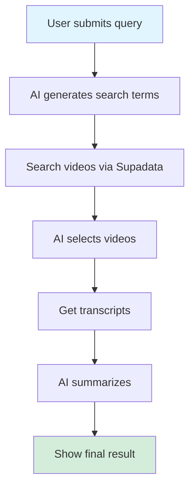
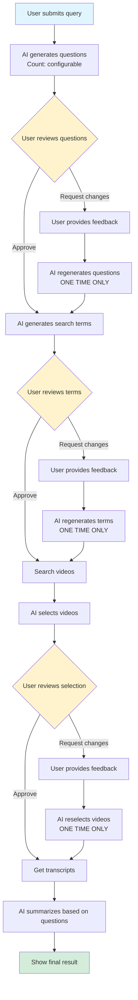
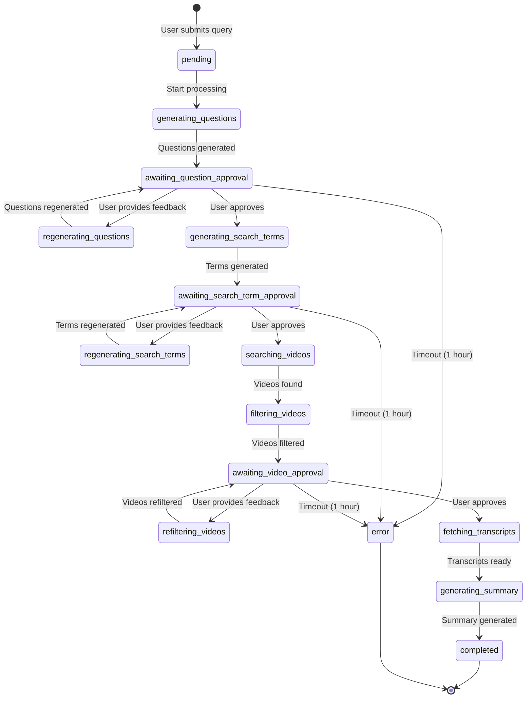

# Enhanced Research Workflow with User Feedback Loops - PRD

## Executive Summary

This PRD outlines the enhancement of our smart research feature to include multiple user feedback loops, transforming it from a fully automated workflow into an interactive, collaborative research process. Users will be able to guide the AI's direction at critical decision points while maintaining the efficiency of automation.

**Document Version**: 1.0  
**Last Updated**: 2026-01-28  
**Status**: Planning  
**Priority**: High  

---

## Table of Contents

1. [Overview](#overview)
2. [Current vs Enhanced Workflow](#current-vs-enhanced-workflow)
3. [Detailed Workflow Specification](#detailed-workflow-specification)
4. [UI/UX Requirements](#uiux-requirements)
5. [Race Condition Prevention](#race-condition-prevention)
6. [State Management](#state-management)
7. [Backend Changes](#backend-changes)
8. [Frontend Changes](#frontend-changes)
9. [Configuration Changes](#configuration-changes)
10. [Error Handling](#error-handling)
11. [Success Metrics](#success-metrics)

---

## Overview

### Goals

1. **Increase user control**: Allow users to guide AI at critical decision points
2. **Improve output quality**: User feedback ensures AI stays aligned with research intent
3. **Enhance transparency**: Show AI reasoning at each step for better understanding
4. **Maintain efficiency**: Limit feedback loops to prevent workflow bloat (max 1 feedback per stage)

### Non-Goals

- Unlimited regeneration attempts (only 1 feedback chance per stage)
- Manual video selection from full list (AI still does filtering, user confirms/rejects)
- Real-time editing of AI outputs (users provide direction, not direct edits)

---

## Current vs Enhanced Workflow

### Current Workflow (Fully Automated)



**Characteristics**:
- No user intervention after initial query
- Processing time: ~2.5-3.5 minutes
- User sees only final result
- No course correction possible

### Enhanced Workflow (Interactive)



**Characteristics**:
- 3 user decision points (questions, search terms, video selection)
- 1 feedback opportunity per stage (no infinite loops)
- Estimated processing time: 3-6 minutes (varies by user interaction speed)
- Users guide AI direction without manual work

---

## Detailed Workflow Specification

### Stage 1: Research Question Generation

#### Step 1.1: AI Generates Questions

**Trigger**: User submits research query

**AI Task**:
- Generate N questions (configurable via `config.yaml`)
- Questions should cover different angles of the research query
- Use enhanced thinking mode for better question diversity

**Backend Processing**:
```typescript
// Status: generating_questions (progress: 5-10%)
const questions = await generateResearchQuestions(
  researchQuery,
  language,
  questionCount // from config: research.question_count
);

// Store in job object
updateJobStatus(jobId, 'awaiting_question_approval', {
  progress: 10,
  research_data: {
    research_query: researchQuery,
    generated_questions: questions,
    question_approval_status: 'pending',
    question_feedback_count: 0,
  },
});
```

**Output Format**:
```json
{
  "questions": [
    "What are the latest developments in [topic] as of 2026?",
    "What are the root causes driving [trend]?",
    "What are the real-world implications for [stakeholders]?",
    "What contrarian perspectives exist on [topic]?",
    "What actionable strategies can [audience] implement?"
  ]
}
```

**UI Display**:
- Show all questions in numbered list
- Display prominently with clear formatting
- Show original research query for context

#### Step 1.2: User Review & Feedback

**User Actions**:
1. **Approve**: Questions look good, proceed to next stage
2. **Provide Feedback**: Questions need adjustment

**Feedback Input**:
- Text area for user to describe desired changes
- Examples shown to guide users:
  - "Focus more on recent 2026 developments"
  - "Add a question about economic impact"
  - "Make questions more specific to healthcare sector"
  - "Avoid questions about history, focus on future trends"

**UI Requirements**:
- Clear approve/feedback buttons
- Feedback textarea (100-500 characters)
- Countdown showing "1 regeneration remaining" or "No regenerations left"
- Disable submit during processing

**State Tracking**:
```typescript
interface QuestionApprovalState {
  status: 'pending' | 'approved' | 'regenerating' | 'regenerated';
  feedback_count: 0 | 1; // Max 1 feedback
  user_feedback?: string; // If feedback provided
}
```

#### Step 1.3: Regeneration (If Requested)

**Trigger**: User provides feedback

**Backend Processing**:
```typescript
// Status: regenerating_questions (progress: 11-15%)
const updatedQuestions = await regenerateResearchQuestions(
  researchQuery,
  language,
  originalQuestions,
  userFeedback, // User's guidance
  questionCount
);

// Store regenerated questions
updateJobStatus(jobId, 'awaiting_question_approval', {
  progress: 15,
  research_data: {
    generated_questions: updatedQuestions,
    question_approval_status: 'pending',
    question_feedback_count: 1, // Max reached
    previous_questions: originalQuestions, // Keep history
  },
});
```

**Important Rules**:
- Only 1 regeneration allowed per stage
- After regeneration, user must approve (no further feedback option)
- If user rejects regenerated questions, workflow continues anyway (graceful degradation)

---

### Stage 2: Search Term Generation

#### Step 2.1: AI Generates Search Terms

**Trigger**: User approves questions

**AI Task**:
- Generate search terms based on approved questions
- Each question informs multiple search terms
- Use existing prompt but add questions as context

**Backend Processing**:
```typescript
// Status: generating_search_terms (progress: 20-25%)
const searchTerms = await generateSearchTerms(
  researchQuery,
  approvedQuestions, // Pass questions to inform terms
  language,
  termsPerQuestion: config.research.search_terms_per_question
);

// Store in job object
updateJobStatus(jobId, 'awaiting_search_term_approval', {
  progress: 25,
  research_data: {
    generated_search_terms: searchTerms,
    search_term_approval_status: 'pending',
    search_term_feedback_count: 0,
  },
});
```

**Output Format**:
```json
{
  "search_terms": [
    "AI healthcare diagnosis accuracy 2026",
    "hospital AI implementation case studies 2026",
    "AI medical imaging breakthrough",
    "AI healthcare ethics concerns",
    "AI patient care workflow automation"
  ],
  "term_to_question_mapping": {
    "AI healthcare diagnosis accuracy 2026": "question_1",
    "hospital AI implementation case studies 2026": "question_1",
    ...
  }
}
```

**UI Display**:
- Group search terms by question (if mapping provided)
- Show which question each term relates to
- Display original questions for context

#### Step 2.2: User Review & Feedback

**User Actions**:
1. **Approve**: Search terms look good, proceed
2. **Provide Feedback**: Terms need adjustment

**Feedback Examples**:
- "Focus more on recent 2026 studies"
- "Add terms about cost implications"
- "Avoid terms about consumer devices, focus on hospital systems"
- "Make terms more specific to diagnostic imaging"

**UI Requirements**:
- Same pattern as question approval
- Show regeneration count
- Feedback textarea (100-500 characters)

#### Step 2.3: Regeneration (If Requested)

**Backend Processing**:
```typescript
// Status: regenerating_search_terms (progress: 26-30%)
const updatedSearchTerms = await regenerateSearchTerms(
  researchQuery,
  approvedQuestions,
  originalSearchTerms,
  userFeedback,
  language
);

updateJobStatus(jobId, 'awaiting_search_term_approval', {
  progress: 30,
  research_data: {
    generated_search_terms: updatedSearchTerms,
    search_term_approval_status: 'pending',
    search_term_feedback_count: 1, // Max reached
    previous_search_terms: originalSearchTerms,
  },
});
```

---

### Stage 3: Video Search (No User Interaction)

**Trigger**: User approves search terms

**Backend Processing**:
```typescript
// Status: searching_videos (progress: 35-45%)
const videoResults = await searchYouTubeVideosBatch(
  approvedSearchTerms,
  searchOptions
);

updateJobStatus(jobId, 'videos_found', {
  progress: 45,
  research_data: {
    raw_video_results: videoResults,
    video_count: videoResults.length,
  },
});
```

**No User Interaction**: This step proceeds automatically

---

### Stage 4: Video Selection & Filtering

#### Step 4.1: AI Selects Videos

**Trigger**: Video search completes

**AI Task**:
- Filter videos based on approved questions
- Select videos that best answer each question
- Classify videos (Direct, Foundational, Contrarian)
- Provide selection rationale

**Backend Processing**:
```typescript
// Status: filtering_videos (progress: 45-55%)
const selectedVideos = await filterVideos(
  researchQuery,
  approvedQuestions, // Use questions to guide filtering
  videoResults,
  language
);

updateJobStatus(jobId, 'awaiting_video_approval', {
  progress: 55,
  research_data: {
    selected_videos: selectedVideos,
    video_approval_status: 'pending',
    video_feedback_count: 0,
  },
});
```

**Output Format**:
```json
{
  "selected_videos": [
    {
      "video_id": "abc123",
      "title": "AI in Healthcare 2026: Complete Guide",
      "channel": "Medical AI Today",
      "thumbnail": "https://...",
      "duration_seconds": 1200,
      "url": "https://youtube.com/watch?v=abc123",
      "classification": "Direct",
      "why_selected": "Comprehensively addresses question 1 about latest developments",
      "fills_gap": "Provides 2026-specific data and case studies",
      "answers_questions": ["question_1", "question_3"]
    },
    ...
  ]
}
```

**UI Display**:
- Show video cards with thumbnails
- Display selection rationale for each video
- Show which questions each video answers
- Group by classification (optional)

#### Step 4.2: User Review & Feedback

**User Actions**:
1. **Approve**: Video selection looks good
2. **Provide Feedback**: Videos need adjustment

**Feedback Examples**:
- "Include more recent videos (2026 only)"
- "Focus on academic sources, reduce news channels"
- "Need more contrarian perspectives"
- "Avoid videos shorter than 15 minutes"
- "Include more videos about cost analysis"

**UI Requirements**:
- Video cards clearly displayed
- Selection rationale visible
- Question mapping shown
- Feedback textarea (100-500 characters)

#### Step 4.3: Regeneration (If Requested)

**Backend Processing**:
```typescript
// Status: refiltering_videos (progress: 56-60%)
const updatedVideoSelection = await refilterVideos(
  researchQuery,
  approvedQuestions,
  videoResults, // Same pool of videos
  originalSelection,
  userFeedback,
  language
);

updateJobStatus(jobId, 'awaiting_video_approval', {
  progress: 60,
  research_data: {
    selected_videos: updatedVideoSelection,
    video_approval_status: 'pending',
    video_feedback_count: 1, // Max reached
    previous_selected_videos: originalSelection,
  },
});
```

**Important**: Refiltering uses the same pool of videos from search, just different selection logic based on feedback

---

### Stage 5: Transcript Fetching (No User Interaction)

**Trigger**: User approves video selection

**Backend Processing**:
```typescript
// Status: fetching_transcripts (progress: 65-75%)
const transcripts = await fetchTranscriptsBatch(
  approvedVideos.map(v => v.url)
);

updateJobStatus(jobId, 'transcripts_ready', {
  progress: 75,
  research_data: {
    transcripts: transcripts,
    transcript_success_count: transcripts.filter(t => !t.error).length,
  },
});
```

**No User Interaction**: Proceeds automatically

---

### Stage 6: Final Summary Generation (No User Interaction)

**Trigger**: Transcripts are ready

**Backend Processing**:
```typescript
// Status: generating_summary (progress: 75-95%)
const finalSummary = await generateResearchSummary(
  researchQuery,
  approvedQuestions, // Use questions to structure summary
  transcripts,
  approvedVideos,
  language,
  onChunk // Streaming support
);

updateJobStatus(jobId, 'completed', {
  progress: 100,
  research_data: {
    final_summary_text: finalSummary,
  },
});
```

**Summary Structure**: Organized around approved questions (each question becomes a section)

---

## UI/UX Requirements

### Component Hierarchy

```
ResearchWorkflowContainer
├── ResearchQueryInput (existing)
├── WorkflowProgressTracker (new)
│   ├── StageIndicator × 6
│   └── CurrentStageHighlight
├── ApprovalStageRenderer (new)
│   ├── QuestionApprovalCard
│   │   ├── QuestionList
│   │   ├── FeedbackInput (conditional)
│   │   └── ApprovalButtons
│   ├── SearchTermApprovalCard
│   │   ├── SearchTermList
│   │   ├── FeedbackInput (conditional)
│   │   └── ApprovalButtons
│   └── VideoApprovalCard
│       ├── VideoGrid
│       ├── VideoCard × N
│       ├── FeedbackInput (conditional)
│       └── ApprovalButtons
└── ResearchResultCard (existing, updated)
```

### New Components

#### 1. WorkflowProgressTracker

**Purpose**: Show user where they are in the workflow

**Visual Design**:
```
[●] Query Submitted
 │
[○] Questions (Awaiting Approval)
 │
[ ] Search Terms
 │
[ ] Videos
 │
[ ] Summary
 │
[ ] Completed
```

**States**:
- Completed: ● (filled circle, green)
- Current: ○ (outline circle, blue, pulsing)
- Awaiting: [ ] (empty, gray)
- Processing: ⟳ (spinner)

**Props**:
```typescript
interface WorkflowProgressTrackerProps {
  currentStage: WorkflowStage;
  stageStatuses: Record<WorkflowStage, StageStatus>;
}

type WorkflowStage = 
  | 'query_submitted'
  | 'questions'
  | 'search_terms'
  | 'videos'
  | 'transcripts'
  | 'summary';

type StageStatus = 
  | 'completed'
  | 'current'
  | 'awaiting'
  | 'processing';
```

#### 2. ApprovalCard (Generic Component)

**Purpose**: Reusable component for all approval stages

**Structure**:
```tsx
<ApprovalCard
  title="Review Generated Questions"
  subtitle="These questions will guide the AI research process"
  items={questions}
  renderItem={(q, idx) => <QuestionItem key={idx} question={q} />}
  showFeedback={feedbackCount === 0}
  onApprove={handleApprove}
  onRequestChanges={handleFeedback}
  feedbackPlaceholder="Describe how you'd like the questions adjusted..."
  regenerationsRemaining={1 - feedbackCount}
  isProcessing={isProcessing}
/>
```

**Props**:
```typescript
interface ApprovalCardProps<T> {
  title: string;
  subtitle?: string;
  items: T[];
  renderItem: (item: T, index: number) => React.ReactNode;
  showFeedback: boolean;
  onApprove: () => Promise<void>;
  onRequestChanges: (feedback: string) => Promise<void>;
  feedbackPlaceholder: string;
  regenerationsRemaining: number;
  isProcessing: boolean;
  contextInfo?: React.ReactNode; // Optional context (e.g., original query)
}
```

#### 3. QuestionItem

**Purpose**: Display a single research question

**Visual Design**:
```
┌─────────────────────────────────────────────────────┐
│ 1. What are the latest developments in AI          │
│    healthcare as of 2026?                           │
│                                                     │
│    💡 This question will explore current trends     │
└─────────────────────────────────────────────────────┘
```

**Props**:
```typescript
interface QuestionItemProps {
  question: string;
  index: number;
  explanation?: string; // Why this question matters
}
```

#### 4. SearchTermItem

**Purpose**: Display a search term with context

**Visual Design**:
```
┌─────────────────────────────────────────────────────┐
│ 🔍 AI healthcare diagnosis accuracy 2026            │
│                                                     │
│    Related to: Question 1 (Latest developments)     │
└─────────────────────────────────────────────────────┘
```

**Props**:
```typescript
interface SearchTermItemProps {
  term: string;
  relatedQuestion?: string; // Which question this term addresses
}
```

#### 5. VideoSelectionCard

**Purpose**: Display selected video with selection rationale

**Visual Design**:
```
┌─────────────────────────────────────────────────────┐
│  [Thumbnail]    AI in Healthcare 2026               │
│                 Medical AI Today                    │
│                 20:15 • 1.2M views                  │
│                                                     │
│  ✅ Direct • Answers Q1, Q3                        │
│  "Comprehensively addresses question 1..."          │
└─────────────────────────────────────────────────────┘
```

**Props**:
```typescript
interface VideoSelectionCardProps {
  video: SelectedVideo;
  showRationale: boolean;
}
```

### Interaction Patterns

#### Approval Flow

1. **Initial Display**:
   - Show all items (questions/terms/videos)
   - Display context (original query, related questions)
   - Show regeneration count: "1 regeneration remaining"

2. **Approve Action**:
   - Click "Approve & Continue" button
   - Button shows loading state
   - Progress tracker updates
   - Next stage loads

3. **Request Changes Action**:
   - Click "Request Changes" button
   - Feedback textarea expands
   - User types feedback (100-500 chars)
   - Click "Submit Feedback" button
   - Button shows loading state
   - Wait for regeneration
   - Display updated items with "No regenerations remaining"
   - User must approve (no more feedback option)

#### Loading States

**During AI Processing**:
- Show spinner overlay
- Display status message (e.g., "Regenerating questions based on your feedback...")
- Disable all buttons
- Show estimated time remaining (if available)

**During User Review**:
- Show items clearly
- Enable approve button immediately
- Enable feedback button (if regenerations remaining)
- No loading states

### Existing UI Elements to Reuse

From existing codebase:

1. **ResearchForm** → Keep for initial query input
2. **ResearchProgressSidebar** → Extend to show workflow stages
3. **ResearchResultCard** → Reuse for final summary display
4. **ResearchOrb** → Keep for visual effects
5. **Button** (from `ui/Button`) → Reuse for all actions
6. **DropdownMenu** → Reuse for language selection

### Configuration Display

Show relevant config values to set user expectations:

- Question count: "AI will generate {N} research questions"
- Video count: "AI will select {N} videos from search results"
- Regeneration limit: "You can request changes once per stage"

---

## Race Condition Prevention

### Critical Race Conditions

#### 1. Double-Click on Approve Button

**Scenario**: User clicks "Approve" twice rapidly

**Prevention Strategy**:
```typescript
// Frontend: ApprovalCard.tsx
const [isSubmitting, setIsSubmitting] = React.useState(false);

const handleApprove = async () => {
  if (isSubmitting) return; // Guard clause
  
  setIsSubmitting(true);
  try {
    await approveStage(jobId, currentStage);
  } finally {
    // Keep button disabled until next stage loads
    // Don't reset isSubmitting here
  }
};
```

**Backend Prevention**:
```typescript
// Backend: research.controller.ts
const approvalCache = new Map<string, { stage: string; timestamp: number }>();

function checkDuplicateApproval(jobId: string, stage: string): boolean {
  const cacheKey = `${jobId}:${stage}`;
  const cached = approvalCache.get(cacheKey);
  
  if (cached && (Date.now() - cached.timestamp) < 5000) {
    return true; // Duplicate within 5 seconds
  }
  
  approvalCache.set(cacheKey, { stage, timestamp: Date.now() });
  return false;
}
```

#### 2. Multiple Browser Tabs

**Scenario**: User opens research in multiple tabs, approves in one tab

**Prevention Strategy**:
- Track approval status in job object (single source of truth)
- All tabs poll same job status
- When one tab approves, others see status change and update UI
- Show "Approved in another window" message if detected

**Implementation**:
```typescript
// Frontend: useResearchStatus hook
useEffect(() => {
  const eventSource = new EventSource(`/api/research/${jobId}/status`);
  
  eventSource.onmessage = (event) => {
    const status = JSON.parse(event.data);
    
    // Check if approval happened elsewhere
    if (status.question_approval_status === 'approved' && 
        localApprovalStatus === 'pending') {
      showNotification('Questions approved in another window');
      setLocalApprovalStatus('approved');
    }
  };
}, [jobId]);
```

#### 3. Network Retry

**Scenario**: Approval request fails, user retries, first request succeeds late

**Prevention Strategy**:
- Use idempotent approval endpoint
- Check current stage before processing approval
- Return success if already approved

**Implementation**:
```typescript
// Backend: approveStage endpoint
async function approveStage(req: Request, res: Response) {
  const { jobId, stage } = req.params;
  const job = getJob(jobId);
  
  // Check if already approved
  if (job.research_data[`${stage}_approval_status`] === 'approved') {
    return res.status(200).json({
      success: true,
      message: 'Already approved',
      already_approved: true,
    });
  }
  
  // Process approval...
}
```

#### 4. Feedback Submission During Regeneration

**Scenario**: User submits feedback, AI is regenerating, user submits again

**Prevention Strategy**:
- Disable feedback button during regeneration
- Track regeneration status in job object
- Reject new feedback if already regenerating

**Implementation**:
```typescript
// Frontend: FeedbackForm
const isRegenerating = status === 'regenerating_questions';

<Button
  disabled={isRegenerating || isSubmitting || feedbackCount >= 1}
  onClick={handleSubmitFeedback}
>
  {isRegenerating ? 'Regenerating...' : 'Submit Feedback'}
</Button>
```

#### 5. Page Refresh During Approval

**Scenario**: User approves, page refreshes before status updates

**Prevention Strategy**:
- Approval is immediately saved to job object (backend)
- On page load, fetch current job status
- Resume from current stage
- Show "Resuming from [stage]..." message

**Implementation**:
```typescript
// Frontend: ResearchWorkflowContainer
useEffect(() => {
  const loadJobStatus = async () => {
    const status = await fetchJobStatus(jobId);
    
    // Determine current stage from status
    const currentStage = determineCurrentStage(status);
    setCurrentStage(currentStage);
    
    // If awaiting approval, show approval UI
    if (status.status.includes('awaiting_')) {
      setShowApprovalUI(true);
    }
  };
  
  loadJobStatus();
}, [jobId]);
```

### State Transition Guards

**Valid State Transitions**:
```typescript
type ResearchStatus =
  | 'pending'
  | 'generating_questions'
  | 'awaiting_question_approval'
  | 'regenerating_questions'
  | 'generating_search_terms'
  | 'awaiting_search_term_approval'
  | 'regenerating_search_terms'
  | 'searching_videos'
  | 'filtering_videos'
  | 'awaiting_video_approval'
  | 'refiltering_videos'
  | 'fetching_transcripts'
  | 'generating_summary'
  | 'completed'
  | 'error';

const VALID_TRANSITIONS: Record<ResearchStatus, ResearchStatus[]> = {
  'pending': ['generating_questions', 'error'],
  'generating_questions': ['awaiting_question_approval', 'error'],
  'awaiting_question_approval': [
    'regenerating_questions',
    'generating_search_terms',
    'error'
  ],
  'regenerating_questions': ['awaiting_question_approval', 'error'],
  'generating_search_terms': ['awaiting_search_term_approval', 'error'],
  // ... etc
};

function validateStateTransition(
  from: ResearchStatus,
  to: ResearchStatus
): boolean {
  return VALID_TRANSITIONS[from]?.includes(to) ?? false;
}
```

### Concurrency Control

**Maximum Regenerations**:
```typescript
// Enforce at both frontend and backend
const MAX_FEEDBACK_PER_STAGE = 1;

// Frontend validation
if (feedbackCount >= MAX_FEEDBACK_PER_STAGE) {
  showError('No regenerations remaining for this stage');
  return;
}

// Backend validation
if (job.research_data.question_feedback_count >= MAX_FEEDBACK_PER_STAGE) {
  return res.status(400).json({
    error: 'Maximum feedback attempts reached for this stage',
  });
}
```

---

## State Management

### Job Object Structure (Extended)

```typescript
interface ResearchJobInfo extends JobInfo {
  research_data: {
    // Core fields
    research_query: string;
    language: string;
    
    // Stage 1: Questions
    generated_questions?: string[];
    question_approval_status?: 'pending' | 'approved' | 'regenerating';
    question_feedback_count?: 0 | 1;
    question_user_feedback?: string;
    previous_questions?: string[]; // Before regeneration
    
    // Stage 2: Search Terms
    generated_search_terms?: string[];
    search_term_approval_status?: 'pending' | 'approved' | 'regenerating';
    search_term_feedback_count?: 0 | 1;
    search_term_user_feedback?: string;
    previous_search_terms?: string[];
    
    // Stage 3: Video Search (no approval)
    raw_video_results?: VideoSearchResult[];
    video_count?: number;
    
    // Stage 4: Video Selection
    selected_videos?: SelectedVideo[];
    video_approval_status?: 'pending' | 'approved' | 'regenerating';
    video_feedback_count?: 0 | 1;
    video_user_feedback?: string;
    previous_selected_videos?: SelectedVideo[];
    
    // Stage 5: Transcripts (no approval)
    transcripts?: TranscriptData[];
    transcript_success_count?: number;
    
    // Stage 6: Summary (no approval)
    final_summary_text?: string;
    
    // Processing stats
    processing_stats?: ResearchProcessingStats;
  };
}
```

### Frontend State Management

**Recommendation**: Use existing patterns from summary feature

```typescript
// hooks/useResearchWorkflow.ts
interface ResearchWorkflowState {
  jobId: string | null;
  status: ResearchStatus;
  progress: number;
  currentStage: WorkflowStage;
  
  // Stage-specific state
  questions?: string[];
  questionApprovalStatus?: ApprovalStatus;
  questionFeedbackCount?: number;
  
  searchTerms?: string[];
  searchTermApprovalStatus?: ApprovalStatus;
  searchTermFeedbackCount?: number;
  
  videos?: SelectedVideo[];
  videoApprovalStatus?: ApprovalStatus;
  videoFeedbackCount?: number;
  
  finalSummary?: string;
  error?: string;
}

function useResearchWorkflow(initialQuery: string) {
  const [state, setState] = useState<ResearchWorkflowState>(/* ... */);
  
  // Actions
  const submitQuery = async () => { /* ... */ };
  const approveQuestions = async () => { /* ... */ };
  const requestQuestionChanges = async (feedback: string) => { /* ... */ };
  const approveSearchTerms = async () => { /* ... */ };
  const requestSearchTermChanges = async (feedback: string) => { /* ... */ };
  const approveVideos = async () => { /* ... */ };
  const requestVideoChanges = async (feedback: string) => { /* ... */ };
  
  return {
    state,
    actions: {
      submitQuery,
      approveQuestions,
      requestQuestionChanges,
      approveSearchTerms,
      requestSearchTermChanges,
      approveVideos,
      requestVideoChanges,
    },
  };
}
```

### Persistent State Considerations

**User Leaves Mid-Workflow**:
- Job state persisted in backend job object
- User can return later and resume
- Show "Resume Research" UI if incomplete job exists

**Session Timeout**:
- Backend cleans up jobs older than 1 hour in "awaiting_approval" state
- User receives "Session expired" message if they return after timeout
- Must start new research

---

## Backend Changes

### New API Endpoints

#### 1. Approve Stage Endpoint

```typescript
POST /api/research/:job_id/approve/:stage

Request body: (empty)

Response:
{
  "success": true,
  "next_status": "generating_search_terms",
  "message": "Questions approved. Generating search terms..."
}
```

**Stages**: `questions`, `search_terms`, `videos`

#### 2. Request Changes Endpoint

```typescript
POST /api/research/:job_id/regenerate/:stage

Request body:
{
  "feedback": "Focus more on recent 2026 developments"
}

Response:
{
  "success": true,
  "status": "regenerating_questions",
  "message": "Regenerating questions based on your feedback..."
}
```

### New Service Functions

#### research.service.ts Additions

```typescript
/**
 * Generate research questions from query
 */
export async function generateResearchQuestions(
  researchQuery: string,
  language: string,
  questionCount: number
): Promise<string[]> {
  const prompt = getQuestionGenerationPrompt({
    researchQuery,
    language,
    questionCount,
  });
  
  const aiResult = await callQwenPlus(prompt, undefined, {
    enable_thinking: true,
    thinking_budget: 4000,
  });
  
  // Parse questions from AI response
  const questions = parseQuestionsFromAI(aiResult.content);
  
  return questions;
}

/**
 * Regenerate questions based on user feedback
 */
export async function regenerateResearchQuestions(
  researchQuery: string,
  language: string,
  originalQuestions: string[],
  userFeedback: string,
  questionCount: number
): Promise<string[]> {
  const prompt = getQuestionRegenerationPrompt({
    researchQuery,
    language,
    originalQuestions,
    userFeedback,
    questionCount,
  });
  
  const aiResult = await callQwenPlus(prompt, undefined, {
    enable_thinking: true,
    thinking_budget: 4000,
  });
  
  const updatedQuestions = parseQuestionsFromAI(aiResult.content);
  
  return updatedQuestions;
}

/**
 * Generate search terms from questions
 */
export async function generateSearchTermsFromQuestions(
  researchQuery: string,
  questions: string[],
  language: string,
  termsPerQuestion: number
): Promise<string[]> {
  // Modified to include questions in prompt
  const prompt = getSearchTermGenerationPrompt({
    researchQuery,
    questions,
    language,
    targetTermCount: questions.length * termsPerQuestion,
  });
  
  const aiResult = await callQwenPlus(prompt, undefined, {
    enable_thinking: true,
    enable_search: true,
  });
  
  const searchTerms = parseSearchTermsFromAI(aiResult.content);
  
  return searchTerms;
}

/**
 * Filter videos based on questions
 */
export async function filterVideosWithQuestions(
  researchQuery: string,
  questions: string[],
  videoResults: VideoSearchResult[],
  language: string,
  userFeedback?: string
): Promise<SelectedVideo[]> {
  const prompt = getVideoFilteringPromptWithQuestions({
    researchQuery,
    questions,
    videoResults,
    userFeedback,
  });
  
  const aiResult = await callQwenPlus(prompt);
  
  const selectedVideos = parseVideoSelectionFromAI(aiResult.content);
  
  return selectedVideos;
}
```

### Updated Orchestration Flow

```typescript
export async function processResearchWithFeedback(
  userId: string | null,
  request: ResearchRequest,
  jobId: string,
  isGuest?: boolean,
  guestSessionId?: string | null
): Promise<string> {
  try {
    // Stage 1: Generate questions (auto-proceed initially)
    const questions = await generateResearchQuestions(
      request.research_query,
      request.language,
      researchConfig.question_count
    );
    
    updateJobStatus(jobId, 'awaiting_question_approval', {
      progress: 10,
      research_data: {
        research_query: request.research_query,
        generated_questions: questions,
        question_approval_status: 'pending',
        question_feedback_count: 0,
      },
    });
    
    // WAIT for user approval (non-blocking - return control)
    // Workflow continues when user calls /approve/questions endpoint
    
    // ... remaining stages follow similar pattern
    
  } catch (error) {
    // Error handling
  }
}
```

**Important**: The orchestration function returns early at each approval stage. Workflow continues via approval endpoints.

### New Prompt Templates

#### 1. Question Generation Prompt

```markdown
# File: backend/src/prompts/research/question-generation.md

You are helping a user conduct comprehensive research on the following topic:

**Research Query**: {research_query}

Your task is to generate {question_count} research questions that will guide an in-depth exploration of this topic.

## Question Quality Criteria

Each question should:
1. **Be specific and answerable**: Focused enough to be addressed with video content
2. **Cover a distinct aspect**: No overlapping or redundant questions
3. **Promote depth**: Encourage analysis beyond surface-level facts
4. **Be balanced**: Include current state, causes, implications, and alternatives

## Question Framework

Generate questions covering these dimensions:
- **Current State**: What is happening right now? (facts, data, examples)
- **Root Causes**: Why is this happening? (mechanisms, forces, history)
- **Implications**: What are the consequences? (impact, ripple effects)
- **Action**: What should be done? (strategies, recommendations)
- **Alternatives**: What are contrarian views? (dissent, challenges, alternatives)

## Output Format

Return exactly {question_count} questions in this format:

```json
{
  "questions": [
    "What are the latest developments in [topic] as of 2026?",
    "What are the root causes driving [trend]?",
    ...
  ]
}
```

**Important**: Questions should be in {language}.
```

#### 2. Question Regeneration Prompt

```markdown
# File: backend/src/prompts/research/question-regeneration.md

You previously generated these research questions:

{original_questions}

The user has provided this feedback:

**User Feedback**: {user_feedback}

Your task is to regenerate {question_count} research questions that incorporate the user's feedback while maintaining the quality criteria.

## Instructions

1. **Analyze the feedback**: Understand what the user wants to change
2. **Preserve what works**: Keep questions the user didn't critique
3. **Improve based on feedback**: Adjust or replace questions as requested
4. **Maintain balance**: Ensure the new set covers diverse aspects

## Output Format

Return exactly {question_count} questions in JSON format.

**Important**: Questions should be in {language}.
```

#### 3. Search Term Generation (Updated)

```markdown
# File: backend/src/prompts/research/search-term-generation.md (updated)

You are generating YouTube search queries to find videos that answer these research questions:

{questions}

**Research Context**: {research_query}

Your task is to generate {target_term_count} search terms optimized for YouTube.

## Instructions

1. **Map to questions**: Each search term should help answer at least one question
2. **Optimize for YouTube**: Use terms people actually search for
3. **Prioritize recency**: Include year "2026" for time-sensitive topics
4. **Vary specificity**: Mix broad and narrow terms
5. **Target quality sources**: Terms that surface authoritative channels

## Output Format

```json
{
  "search_terms": [
    "AI healthcare diagnosis accuracy 2026",
    "hospital AI implementation case studies",
    ...
  ]
}
```

**Important**: Generate terms that will find {language} videos.
```

#### 4. Video Filtering (Updated)

```markdown
# File: backend/src/prompts/research/video-filtering.md (updated)

You are selecting videos to answer these research questions:

{questions}

**Research Context**: {research_query}

You have {video_count} videos to choose from. Select the best {target_count} videos.

## Selection Criteria

For each question, select videos that:
1. **Directly address the question**: Content clearly answers it
2. **Provide evidence**: Data, examples, or expert analysis
3. **Are authoritative**: Credible sources (academic, news, experts)
4. **Are recent**: Prefer 2026 or 2025 content for current topics

## Diversity Requirements

- **Classification mix**: Include Direct (60%), Foundational (30%), Contrarian (10%)
- **Source variety**: No more than 2 videos from same channel
- **Perspective balance**: Multiple viewpoints on controversial topics

## User Feedback (if provided)

{user_feedback}

**Important**: Adjust selection based on this feedback.

## Output Format

```json
{
  "selected_videos": [
    {
      "title": "...",
      "channel": "...",
      "classification": "Direct",
      "why_selected": "...",
      "fills_gap": "...",
      "answers_questions": [1, 3]
    },
    ...
  ]
}
```

Return exactly {target_count} videos.
```

---

## Configuration Changes

### config.yaml Additions

```yaml
research:
  # Question generation
  question_count: 5 # Number of research questions to generate
  enable_question_approval: true # Allow user to approve/reject questions
  enable_search_term_approval: true # Allow user to approve/reject search terms
  enable_video_approval: true # Allow user to approve/reject video selection
  
  # Search term generation
  queries_per_research: 10 # Kept for backward compatibility
  search_terms_per_question: 2 # Generate 2 search terms per question (total = question_count * 2)
  videos_per_query: 10 # Videos to fetch per search term
  
  # Feedback limits
  max_feedback_per_stage: 1 # Maximum regeneration attempts per stage
  
  # Approval timeouts
  approval_timeout_hours: 1 # Auto-fail job if no approval within 1 hour
  cleanup_pending_jobs_interval_hours: 1 # How often to clean up expired jobs
  
  # Video filtering
  min_video_duration_seconds: 300 # 5 minutes minimum
  max_video_duration_seconds: 5400 # 90 minutes maximum (increased)
  target_selected_videos: 10 # Target number of videos to select
  min_selected_videos: 8 # Minimum number of videos required to proceed
  
  # Summary generation
  use_questions_for_structure: true # Structure summary around approved questions
  include_video_citations: true # Include video citations in summary
  
  # Credit costs (unchanged)
  base_cost: 100 # Base research setup cost
  per_video_cost: 10 # Cost per video transcribed
  
  # Rate limiting (per tier)
  free_tier_max_per_hour: 3 # Reduced due to longer workflow
  starter_tier_max_per_hour: 10
  pro_tier_max_per_hour: 25
  premium_tier_max_per_hour: 50
  
  # Progress percentages (updated)
  progress_percentages:
    created: 0
    generating_questions: 5
    awaiting_question_approval: 10
    regenerating_questions: 11
    generating_search_terms: 20
    awaiting_search_term_approval: 25
    regenerating_search_terms: 26
    searching_videos: 35
    videos_found: 45
    filtering_videos: 50
    awaiting_video_approval: 55
    refiltering_videos: 56
    fetching_transcripts: 65
    transcripts_ready: 75
    generating_summary: 85
    completed: 100
```

### Feature Flags

```yaml
feature_flags:
  enhanced_research_workflow: true # Enable enhanced workflow with approvals
  legacy_research_workflow: false # Disable old automatic workflow
```

**Migration Strategy**:
- Initially, make enhanced workflow opt-in via user preference
- Collect feedback for 2 weeks
- Deprecate legacy workflow
- Make enhanced workflow default

---

## Error Handling

### Error Scenarios

| Scenario | Error Code | User Message | System Action |
|----------|------------|--------------|---------------|
| Approval timeout | `APPROVAL_TIMEOUT` | "Research session expired. Please start a new research." | Mark job as failed, clean up |
| Invalid feedback | `INVALID_FEEDBACK` | "Feedback must be 100-500 characters." | Reject request, keep stage open |
| Max feedback exceeded | `MAX_FEEDBACK_EXCEEDED` | "No regenerations remaining. Please approve current results." | Reject request, show approval only |
| Question generation fails | `QUESTION_GEN_FAILED` | "Failed to generate questions. Please try a different query." | Fail job, refund credits |
| Search term generation fails | `SEARCH_TERM_GEN_FAILED` | "Failed to generate search terms. Please approve questions again." | Return to question approval stage |
| Video filtering fails | `VIDEO_FILTER_FAILED` | "Failed to filter videos. Using top videos by views." | Use fallback selection |
| All regenerations failed | `REGEN_ALL_FAILED` | "Could not generate acceptable results. Please try a different query." | Fail job, refund credits |

### Graceful Degradation

**If user never approves** (timeout):
- Job marked as abandoned after 1 hour
- Credits not deducted (reserved but not charged)
- Job cleaned up from memory

**If regeneration fails**:
- Fall back to original results
- Show warning: "Regeneration failed. Using original results."
- Allow user to approve original or cancel

**If user closes window mid-workflow**:
- Job state persisted
- Show "Resume Research" option on next visit
- If timeout passed, show "Session expired" and allow restart

---

## Success Metrics

### Product Metrics

| Metric | Target | Measurement |
|--------|--------|-------------|
| Approval rate (questions) | >70% | % of times users approve first attempt |
| Approval rate (search terms) | >80% | % of times users approve first attempt |
| Approval rate (videos) | >85% | % of times users approve first attempt |
| Feedback quality | >60% | % of feedback resulting in improved results (survey) |
| Completion rate | >75% | % of started research that reach final summary |
| User satisfaction | >4.0/5 | Post-research survey rating |
| Time to completion | <6 min avg | Average time from query to final summary |

### Technical Metrics

| Metric | Target | Measurement |
|--------|--------|-------------|
| Question generation success | >95% | % of attempts that succeed |
| Search term generation success | >95% | % of attempts that succeed |
| Video filtering success | >90% | % of attempts that succeed |
| Regeneration success rate | >85% | % of feedback requests that produce valid results |
| API error rate | <2% | % of API calls that fail |
| Average regeneration time | <30s | Time to regenerate after feedback |

### Business Metrics

| Metric | Target | Measurement |
|--------|--------|-------------|
| Research adoption (new workflow) | >50% | % of users trying enhanced workflow |
| Preference for enhanced workflow | >60% | % preferring enhanced over legacy (survey) |
| Credit efficiency | 200±20 | Average credits per research |
| Tier upgrade impact | +10% | Increase in upgrades after using feature |

---

## Migration Plan

### Phase 1: Development (Week 1-2)

- [ ] Backend: Implement new service functions
  - [ ] `generateResearchQuestions()`
  - [ ] `regenerateResearchQuestions()`
  - [ ] `generateSearchTermsFromQuestions()`
  - [ ] `filterVideosWithQuestions()`
- [ ] Backend: Add new API endpoints
  - [ ] `POST /api/research/:job_id/approve/:stage`
  - [ ] `POST /api/research/:job_id/regenerate/:stage`
- [ ] Backend: Update orchestration flow
  - [ ] Break into stages with approval gates
  - [ ] Add state transition validation
- [ ] Backend: Create new prompt templates
- [ ] Frontend: Build new components
  - [ ] `WorkflowProgressTracker`
  - [ ] `ApprovalCard` (generic)
  - [ ] `QuestionApprovalCard`
  - [ ] `SearchTermApprovalCard`
  - [ ] `VideoApprovalCard`
- [ ] Frontend: Implement `useResearchWorkflow` hook
- [ ] Add feature flag support

### Phase 2: Testing (Week 2-3)

- [ ] Unit tests: Service functions
- [ ] Unit tests: React components
- [ ] Integration tests: Full workflow
- [ ] Race condition tests
  - [ ] Double-click prevention
  - [ ] Multiple tabs
  - [ ] Network retries
- [ ] Load testing: Concurrent approvals
- [ ] User acceptance testing: Internal team

### Phase 3: Beta Release (Week 3-4)

- [ ] Deploy to staging
- [ ] Enable feature flag for beta users (20%)
- [ ] Monitor metrics
  - [ ] Approval rates
  - [ ] Completion rates
  - [ ] Error rates
- [ ] Collect user feedback
- [ ] Iterate on UI/UX based on feedback

### Phase 4: General Availability (Week 5)

- [ ] Fix critical bugs from beta
- [ ] Deploy to production
- [ ] Enable for all users (feature flag default: true)
- [ ] Deprecate legacy workflow (keep as fallback)
- [ ] Documentation and tutorials
- [ ] Marketing announcement

### Phase 5: Optimization (Week 6+)

- [ ] A/B test variations
  - [ ] Question count (3 vs 5 vs 7)
  - [ ] Approval UI layouts
  - [ ] Regeneration limits (1 vs 2)
- [ ] Optimize AI prompt performance
- [ ] Add advanced features (if successful)
  - [ ] Custom question sets
  - [ ] Save feedback templates

---

## Open Questions

### Questions for Product Team

1. **Question count**: Should it be configurable by user or fixed at 5?
2. **Regeneration limit**: Is 1 per stage too restrictive? Should we allow 2?
3. **Approval timeout**: Is 1 hour too short? Too long?
4. **Credit refund**: Should we refund credits if user abandons mid-workflow?
5. **Legacy support**: How long should we maintain old automatic workflow?

### Questions for Engineering Team

1. **SSE vs Polling**: Should approval stages use SSE or polling?
2. **Job persistence**: Should we persist jobs to Firestore during awaiting_approval states?
3. **Concurrency**: Should we allow multiple research jobs per user in approval state?
4. **Performance**: How to optimize AI calls for regeneration (caching, etc.)?

### Questions for Design Team

1. **Mobile experience**: How should approval UI work on mobile?
2. **Visual feedback**: What loading animations for each stage?
3. **Accessibility**: ARIA labels and keyboard navigation for approval cards?
4. **Onboarding**: Do we need a tutorial for first-time users?

---

## Appendix

### A. Example Workflow Timeline

**User Flow**: "Impact of AI on healthcare"

| Time | Stage | Status | User Action |
|------|-------|--------|-------------|
| 0:00 | Query submitted | Processing | User waits |
| 0:15 | Questions generated | Awaiting approval | User reviews 5 questions |
| 0:45 | User provides feedback | Processing | User waits |
| 1:00 | Questions regenerated | Awaiting approval | User approves |
| 1:05 | Search terms generated | Awaiting approval | User reviews 10 terms |
| 1:20 | User approves | Processing | User waits |
| 1:35 | Videos found | Processing | User waits |
| 2:00 | Videos filtered | Awaiting approval | User reviews 10 videos |
| 2:30 | User approves | Processing | User waits |
| 3:00 | Transcripts fetched | Processing | User waits |
| 4:00 | Summary generating | Processing | User waits |
| 5:30 | Completed | Done | User reads summary |

**Total time**: ~5.5 minutes (with 2 feedback loops)

### B. UI Mockup Descriptions

#### Question Approval Screen

```
┌─────────────────────────────────────────────────────────────┐
│ Research Progress                                           │
│ ● Query → ○ Questions → Search Terms → Videos → Summary     │
└─────────────────────────────────────────────────────────────┘

┌─────────────────────────────────────────────────────────────┐
│ Review Generated Questions                                  │
│                                                             │
│ Original Query: "Impact of AI on healthcare"                │
│                                                             │
│ These questions will guide the AI research:                 │
│                                                             │
│ 1. What are the latest AI healthcare developments in 2026? │
│ 2. What drives healthcare organizations to adopt AI?        │
│ 3. What are the implications for patients and providers?    │
│ 4. What strategies should healthcare leaders implement?     │
│ 5. What concerns do critics raise about AI in medicine?     │
│                                                             │
│ 💡 1 regeneration remaining                                 │
│                                                             │
│ [ Approve & Continue ]  [ Request Changes ]                 │
└─────────────────────────────────────────────────────────────┘
```

#### Feedback Input

```
┌─────────────────────────────────────────────────────────────┐
│ Request Changes to Questions                                │
│                                                             │
│ Describe how you'd like the questions adjusted:            │
│ ┌─────────────────────────────────────────────────────────┐ │
│ │ Focus more on recent 2026 developments and less on      │ │
│ │ general benefits. Add a question about cost-benefit     │ │
│ │ analysis for hospitals.                                  │ │
│ └─────────────────────────────────────────────────────────┘ │
│ 150/500 characters                                          │
│                                                             │
│ [ Cancel ]  [ Submit Feedback ]                             │
└─────────────────────────────────────────────────────────────┘
```

### C. State Machine Diagram



---

## Document History

| Version | Date | Author | Changes |
|---------|------|--------|---------|
| 1.0 | 2026-01-28 | AI Assistant | Initial draft |

---

## Approval Sign-off

| Role | Name | Signature | Date |
|------|------|-----------|------|
| Product Manager | | | |
| Engineering Lead | | | |
| Design Lead | | | |
| QA Lead | | | |

---

**END OF DOCUMENT**
